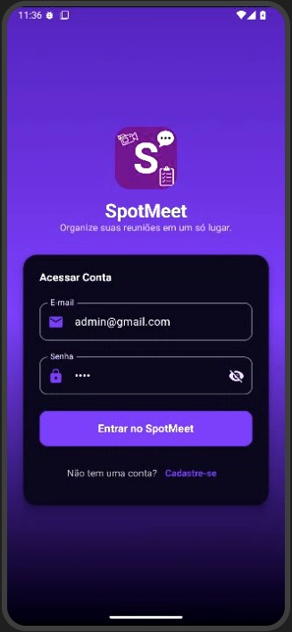
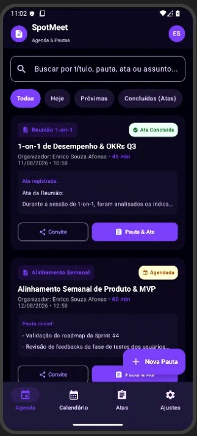
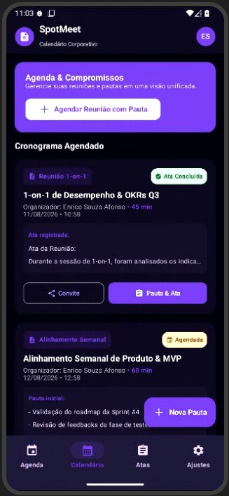
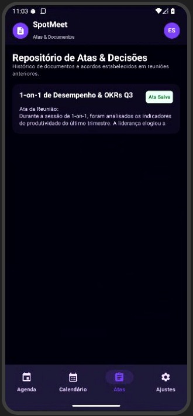
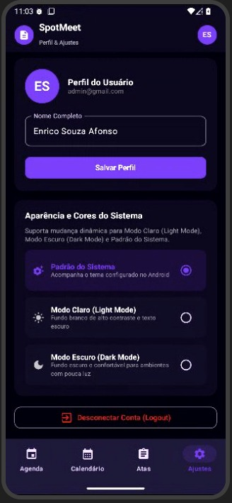

# Bloco 4 - Design e UI/UX do SpotMeet

## 1. Ícone e Logo

### 1.1. Cor da Logo

A logo utiliza o roxo **#901ECE**, escolhido para transmitir modernidade, sofisticação e inovação e para diferenciar visualmente o SpotMeet.

### 1.2. Elemento Principal

O elemento principal da logo é a letra **S**, representando o nome **SpotMeet**.

A letra utiliza a fonte **Bree Serif**, com recortes e formas que buscam transmitir uma identidade moderna, objetiva e reconhecível.

### 1.3. Elementos Adjacentes

A composição utiliza três elementos visuais associados ao contexto de reuniões:

- **Prancheta com checklist:** representa organização de pautas, documentação de atas e acompanhamento das informações da reunião.
- **Balão de conversa:** representa comunicação, colaboração e troca de informações entre os participantes.
- **Câmera:** representa visualmente o universo das reuniões digitais e reforça a associação do SpotMeet ao contexto de encontros profissionais e colaborativos.

## 2. Nome do Aplicativo

O nome do aplicativo é **SpotMeet**.

O nome foi escolhido para representar a ideia de um "ponto de encontro":

- **Spot:** local ou ponto;
- **Meet:** encontrar-se ou reunir-se.

A proposta do nome é representar um local centralizado para organizar e gerenciar informações relacionadas às reuniões.

## 3. Visão Geral da Identidade da Marca

O SpotMeet adota uma identidade moderna e profissional voltada à organização, ao gerenciamento e à produtividade de reuniões.

A identidade visual utiliza tons de violeta e roxo, buscando transmitir organização, agilidade e inovação.

## 4. Cores da Marca e Identidade Visual

| Nome | Cor | Utilização |
|---|---|---|
| SpotMeet Purple Primary | `#7C3AED` | Botões principais, ações de destaque, abas ativas e FAB |
| SpotMeet Purple Dark | `#5B21B6` | Recipientes, bordas e destaques |
| SpotMeet Purple Light | `#A78BFA` | Elementos secundários e contraste em modo escuro |
| SpotMeet Purple Accent | `#C084FC` | Seleções e acentos visuais |
| Ação destrutiva | `#DC2626` | Logout e ações irreversíveis |

A cor `#901ECE` permanece associada especificamente à composição da logo.

## 5. Temas e Superfícies

O SpotMeet deverá oferecer:

- Modo Claro;
- Modo Escuro;
- Padrão do Sistema.

### 5.1. Modo Claro

| Elemento | Cor |
|---|---|
| Fundo da tela | `#FAF7FF` |
| Superfície dos cards | `#FFFFFF` |
| Recipientes e filtros | `#F3E8FF` |
| Texto principal | `#1E1B2E` |
| Texto secundário | `#581C87` ou preto com 60% de opacidade |
| Texto em botões primários | `#FFFFFF` |
| Placeholders / textos de dica | `#808080` ou preto com 50% de opacidade |

### 5.2. Modo Escuro

| Elemento | Cor |
|---|---|
| Fundo da tela | `#0F0C1B` |
| Superfície dos cards | `#1B152B` |
| Recipientes e filtros | `#281F3D` |
| Texto principal | `#FFFFFF` |
| Texto secundário | `#E9D5FF` |
| Texto em botões primários | `#FFFFFF` ou `#0F0C1B` |
| Placeholders / textos de dica | `#808080` ou branco com 50% de opacidade |

## 6. Tipografia

A família tipográfica principal definida para a interface é **Roboto / Sans Serif**, priorizando legibilidade e consistência visual entre as telas.

### 6.1. Escala Tipográfica

| Estilo | Peso | Tamanho | Utilização |
|---|---:|---:|---|
| Headline Large | 700 | 32 sp | Títulos principais |
| Headline Medium | 700 | 28 sp | Títulos em destaque |
| Headline Small | 600 | 24 sp | Subtítulos de seções |
| Title Large | 600 | 22 sp | Modais e detalhes |
| Title Medium | 500 | 16 sp | Cards de reunião |
| Title Small | 500 | 14 sp | Participantes e tópicos |
| Body Large | 400 | 16 sp | Atas e decisões |
| Body Medium | 400 | 14 sp | Formulários e planos de ação |
| Body Small | 400 | 12 sp | Datas, horários e informações complementares |
| Label Large | 500 | 14 sp | Botões |
| Label Small | 500 | 11 sp | Badges de status |

## 7. Componentes Específicos do SpotMeet

### 7.1. Badges de Status

| Status | Fundo | Texto |
|---|---|---|
| Agendada | `#FEF3C7` | `#92400E` |
| Em andamento | `#DBEAFE` | `#1E40AF` |
| Concluída / Ata salva | `#DCFCE7` | `#166534` |

### 7.2. Estrutura Visual

- **Bottom Sheet de criação rápida:** modal inferior arredondado com raio de 24 dp, utilizado para facilitar o início do fluxo de criação.
- **Cards de reunião:** cantos arredondados de 16 dp e elevação de 2 dp.
- **Avatar do usuário:** foto de perfil ou iniciais sobre fundo colorido com formato circular.

## 8. Padrões de Interface

As telas abaixo seguem a ordem principal de acesso e navegação proposta para o SpotMeet.

### Tela de Login

A tela de login é o primeiro contato do usuário com o aplicativo e permite o acesso à conta por meio de e-mail e senha.

O texto de apoio apresentado na tela é:

> **Organize suas reuniões em um só lugar.**

### Agenda

A tela de agenda apresenta reuniões, filtros, status e ações relacionadas a pautas e atas.

### Calendário

A tela de calendário apresenta os compromissos e reuniões agendadas em uma visão organizada.

### Atas

A tela de atas centraliza o histórico de registros e decisões vinculados às reuniões.

### Ajustes

A tela de ajustes permite gerenciar dados do perfil e preferências de aparência do aplicativo.

## 9. Foco na Usabilidade e Experiência do Usuário

O design do SpotMeet foi projetado para facilitar o gerenciamento diário de reuniões e compromissos.

### Interface Intuitiva e Agradável

A hierarquia visual utiliza contraste de cores, tipografia e destaque das ações principais para facilitar tarefas como consultar reuniões, iniciar uma nova pauta e acessar o histórico de atas.

### Responsividade para Android e iOS

Os componentes deverão ser dimensionáveis e adaptáveis a diferentes tamanhos de tela nas plataformas Android e iOS.

### Leitura Rápida e Identificação de Status

O uso de cores distintas para os badges permite identificar rapidamente reuniões agendadas, em andamento e concluídas, enquanto o roxo é utilizado para destacar ações primárias.
