# Bloco 5 - Documento de Requisitos do Incremento 1

## Prefácio

| Versão | Data | Autor | Razão |
|---|---|---|---|
| 1.0 | 23/09/2026 | Equipe SpotMeet | Documentação dos requisitos do Incremento 1 |

## 1. Introdução

O SpotMeet é um aplicativo mobile, para Android e iOS, destinado a organizar equipes em organizações e comissões, como base para a gestão de reuniões prevista para os próximos incrementos. O Incremento 1 entrega o cadastro de usuários, o cadastro de organizações com aprovação do administrador do sistema, o cadastro de comissões dentro das organizações, as configurações da conta do usuário e as informações do sistema para o administrador.

Este documento descreve os requisitos do Incremento 1 conforme implementados no código entregue. Os nomes de classes, métodos, rotas e tabelas citados são os mesmos do código-fonte.

### 1.1. Resumo do Sistema

| Item | Valor |
|---|---|
| Nome | SpotMeet |
| Tipo | Aplicativo mobile (Android e iOS) com servidor próprio (API REST) |
| Linguagens | Java 21 (servidor) e TypeScript 6 (aplicativo) |
| Acesso a banco de dados | Sim (PostgreSQL 18) |

### 1.2. Responsáveis por requisito

| Requisito | Requisitos funcionais | Responsável |
|---|---|---|
| Cadastro de usuário | RF01 a RF05 | João |
| Cadastro de organização | RF06 a RF08 | Lavínia |
| Cadastro de comissão | RF09 a RF13 | Enrico |
| Configurações de usuário | RF14 a RF18 | Vitor |
| Informações do sistema | RF19 a RF23 | Guilherme |

## 2. Arquitetura do Sistema

O sistema segue a arquitetura cliente-servidor. O aplicativo é responsável apenas pela interface e pelo estado da sessão. Toda regra de negócio, validação e autorização fica no servidor, que expõe uma API REST em JSON.

O servidor é organizado em camadas:

- **Controller** (`controller/`): recebe as requisições HTTP. É implementado com o Spring Web (Spring MVC), por meio de classes anotadas com `@RestController`; o Jackson converte os objetos em JSON e o Tomcat embutido atende as requisições.
- **Service** (`service/`): aplica as regras de negócio e as verificações de permissão.
- **Repository** (`repository/`): acessa o banco de dados com Spring Data JPA e Hibernate.
- **Model** (`model/`): entidades JPA que representam as tabelas.
- **DTO** (`dto/`): objetos de entrada e saída da API, validados com Bean Validation.

A autenticação é feita por token JWT enviado no cabeçalho `Authorization` de cada requisição, sem sessão no servidor. O servidor envia e-mails por SMTP para a confirmação de cadastro, a recuperação de conta e a troca de e-mail.

### 2.1. Tecnologias e versões

| Camada | Tecnologia | Versão | Uso |
|---|---|---|---|
| Servidor | Java (OpenJDK) | 21 | Linguagem |
| Servidor | Spring Boot | 3.3.5 | Base do projeto |
| Servidor | Spring Web (Spring MVC) | 6.1.14 | Criação da API REST (`@RestController`) |
| Servidor | Tomcat embutido | 10.1.31 | Servidor HTTP |
| Servidor | Spring Data JPA | 3.3.5 | Repositórios |
| Servidor | Hibernate | 6.5.3 | Mapeamento objeto-relacional |
| Servidor | Spring Security | 6.3.4 | Autenticação, autorização e BCrypt |
| Servidor | JJWT | 0.12.6 | Geração e validação do token JWT |
| Servidor | Hibernate Validator | 8.0.1 | Validação dos DTOs (Bean Validation) |
| Servidor | Jakarta Mail (Spring Mail) | 2.0.3 | Envio de e-mails por SMTP |
| Servidor | Spring Boot Actuator | 3.3.5 | Saúde e identificação do servidor |
| Servidor | Driver PostgreSQL (JDBC) | 42.7.4 | Conexão com o banco |
| Servidor | Maven (Maven Wrapper) | 3.9.16 | Compilação e execução |
| Banco | PostgreSQL | 18.6 | Armazenamento dos dados |
| Aplicativo | Expo SDK | 57 | Ferramentas de desenvolvimento, Expo Go e geração do APK |
| Aplicativo | React Native | 0.86.2 | Interface nativa |
| Aplicativo | React | 19.2.3 | Componentes |
| Aplicativo | TypeScript | 6.0.3 | Tipagem |
| Aplicativo | React Navigation | 7 | Navegação por pilha e por abas |

O Expo foi adotado no Incremento 1 para executar o aplicativo em aparelhos reais pelo Expo Go, sem necessidade de publicação nas lojas, e para gerar o APK do Android.

## 3. Requisitos Não Funcionais de Usuário

Descrevem as propriedades gerais do sistema de forma simples e concisa.

**RNF01 – Plataformas**

O aplicativo deve funcionar em celulares Android e iOS.

**RNF02 – Segurança das senhas**

As senhas dos usuários devem ser armazenadas de forma que não possam ser lidas.

**RNF03 – Senha forte**

O sistema deve exigir senhas com letras maiúsculas, minúsculas e números.

**RNF04 – Acesso autenticado**

Somente usuários autenticados devem acessar as funções do sistema, exceto cadastro, login e recuperação de conta.

**RNF05 – Controle de permissões**

Cada usuário deve executar apenas as ações permitidas pelo seu papel na organização e na comissão.

**RNF06 – Confirmação por e-mail**

O cadastro, a recuperação de conta e a troca de e-mail devem ser confirmados por um código enviado ao e-mail do usuário.

**RNF07 – Tempo de resposta**

As telas devem responder rapidamente às ações do usuário.

**RNF08 – Atualização automática**

As informações exibidas devem ser atualizadas sem que o usuário precise recarregar a tela.

**RNF09 – Conexão com o servidor**

O aplicativo deve encontrar o servidor na rede local sem que o usuário precise digitar o endereço.

**RNF10 – Privacidade**

Os relatórios do administrador do sistema não devem exibir o e-mail completo dos usuários.

**RNF11 – Rastreabilidade**

As ações importantes realizadas no sistema devem ser registradas.

**RNF12 – Tema claro e escuro**

O usuário deve poder escolher entre o tema claro e o tema escuro.

**RNF13 – Confirmação de ações destrutivas**

Ações que apagam dados devem ser confirmadas pelo usuário antes de serem executadas.

**RNF14 – Preservação dos dados**

A atualização do sistema entre incrementos não deve apagar os dados já cadastrados.

**RNF15 – Custo zero**

Todas as tecnologias utilizadas devem ser gratuitas e não exigir assinatura.

## 4. Requisitos Funcionais de Usuário

Descrevem as funcionalidades do sistema de maneira simples e concisa. Para cada requisito do Incremento 1 é apresentado o diagrama de casos de uso, indicando as possibilidades de utilização do sistema por parte de cada ator.

### 4.1. Cadastro de Usuário

**Figura 1 – Diagrama de casos de uso (Cadastro de Usuário)**

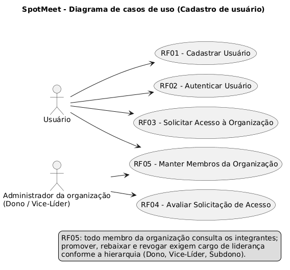

Fonte: próprio autor

**Requisito RF01 – Cadastrar Usuário**

O sistema deve permitir que uma pessoa crie uma conta, confirmando o seu e-mail por meio de um código.

**Requisito RF02 – Autenticar Usuário**

O sistema deve permitir que o usuário entre no aplicativo informando e-mail e senha.

**Requisito RF03 – Solicitar Acesso à Organização**

O sistema deve permitir ao usuário solicitar acesso a uma organização informando a chave de acesso dela.

**Requisito RF04 – Avaliar Solicitação de Acesso**

O sistema deve permitir ao dono ou ao vice-líder da organização aprovar ou rejeitar as solicitações de acesso.

**Requisito RF05 – Manter Membros da Organização**

O sistema deve permitir aos administradores da organização consultar os membros, promovê-los, rebaixá-los e revogar o seu acesso, respeitando a hierarquia de papéis.

### 4.2. Cadastro de Organização

**Figura 2 – Diagrama de casos de uso (Cadastro de Organização)**

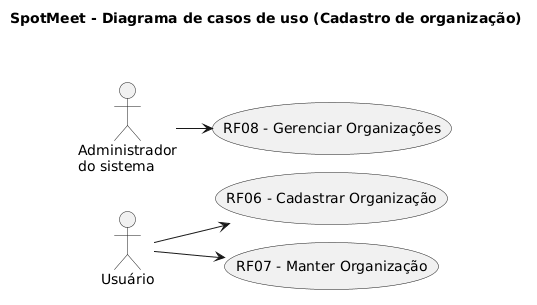

Fonte: próprio autor

**Requisito RF06 – Cadastrar Organização**

O sistema deve permitir ao usuário cadastrar uma nova organização, que fica pendente até a aprovação do administrador do sistema.

**Requisito RF07 – Manter Organização**

O sistema deve permitir ao usuário consultar as suas organizações e, ao dono ou ao vice-líder, editar ou excluir a organização.

**Requisito RF08 – Gerenciar Organizações**

O sistema deve permitir ao administrador do sistema consultar as organizações e aprovar, rejeitar, bloquear ou reativar o seu cadastro.

### 4.3. Cadastro de Comissão

**Figura 3 – Diagrama de casos de uso (Cadastro de Comissão)**

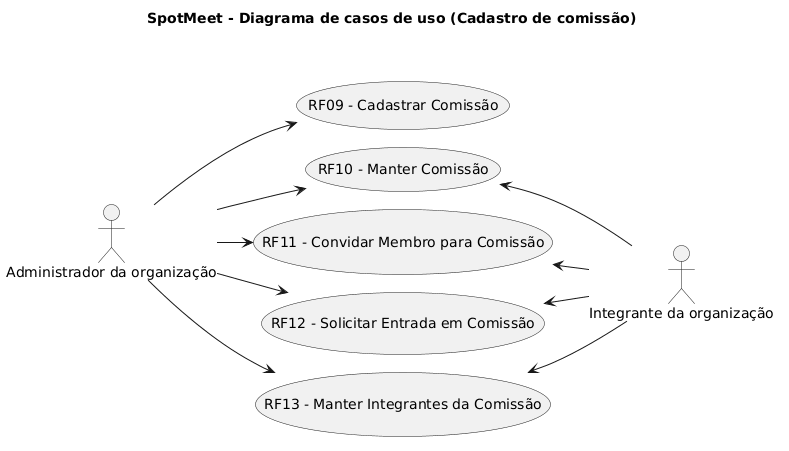

Fonte: próprio autor

**Requisito RF09 – Cadastrar Comissão**

O sistema deve permitir aos administradores da organização cadastrar comissões dentro dela.

**Requisito RF10 – Manter Comissão**

O sistema deve permitir consultar as comissões da organização e, aos administradores da organização, editá-las ou excluí-las.

**Requisito RF11 – Convidar Membro para Comissão**

O sistema deve permitir aos administradores da organização convidar membros para uma comissão, e ao convidado aceitar ou recusar o convite.

**Requisito RF12 – Solicitar Entrada em Comissão**

O sistema deve permitir ao membro da organização solicitar a entrada em uma comissão, e aos administradores da organização aprovar ou rejeitar a solicitação.

**Requisito RF13 – Manter Integrantes da Comissão**

O sistema deve permitir aos administradores da organização remover integrantes das comissões e consultar as comissões de cada membro.

### 4.4. Configurações de Usuário

**Figura 4 – Diagrama de casos de uso (Configurações de Usuário)**

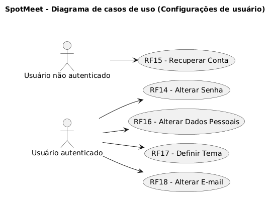

Fonte: próprio autor

**Requisito RF14 – Alterar Senha**

O sistema deve permitir ao usuário autenticado trocar a sua senha, informando a senha atual.

**Requisito RF15 – Recuperar Conta**

O sistema deve permitir ao usuário que esqueceu a senha recuperar a conta por meio de um código enviado ao seu e-mail.

**Requisito RF16 – Alterar Dados Pessoais**

O sistema deve permitir ao usuário alterar os seus dados pessoais.

**Requisito RF17 – Definir Tema**

O sistema deve permitir ao usuário escolher entre o tema claro e o tema escuro do aplicativo.

**Requisito RF18 – Alterar E-mail**

O sistema deve permitir ao usuário trocar o seu e-mail, confirmando a posse do e-mail atual e do novo e-mail.

### 4.5. Informações do Sistema

**Figura 5 – Diagrama de casos de uso (Informações do Sistema)**

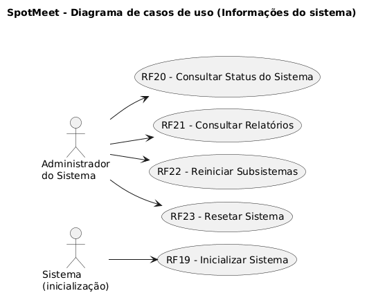

Fonte: próprio autor

**Requisito RF19 – Inicializar Sistema**

O sistema deve preparar o banco de dados e criar a conta do administrador do sistema na primeira inicialização.

**Requisito RF20 – Consultar Status do Sistema**

O sistema deve permitir ao administrador do sistema consultar o status do sistema e dos seus subsistemas.

**Requisito RF21 – Consultar Relatórios**

O sistema deve permitir ao administrador do sistema consultar relatórios de usuários, organizações, comissões e atividades.

**Requisito RF22 – Reiniciar Subsistemas**

O sistema deve permitir ao administrador do sistema reiniciar os subsistemas.

**Requisito RF23 – Resetar Sistema**

O sistema deve permitir ao administrador do sistema apagar todos os dados, preservando apenas a sua própria conta.

## 5. Requisitos Não Funcionais de Sistema

Descrevem as propriedades gerais do sistema de forma completa, indicando as características, as métricas utilizadas e a forma de verificação.

**RNF01 – Plataformas**

O aplicativo é desenvolvido com React Native 0.86.2 e Expo SDK 57, que exigem no mínimo Android 7.0 (API 24) e iOS 15.1. No Android, o aplicativo é executado pelo Expo Go ou por um APK instalável, gerado com `npx expo prebuild` e compilado com o Gradle. No iOS, é executado pelo Expo Go.

Verificação: executar o aplicativo em um aparelho Android e em um iPhone reais e realizar login.

**RNF02 – Segurança das senhas**

As senhas são armazenadas apenas como hash BCrypt com fator de custo 12 (Spring Security 6), na coluna `users.password`. Nenhuma rota da API devolve o hash.

Verificação: consultar `SELECT password FROM users` e confirmar que todos os valores começam com `$2a$12$`; consultar `GET /api/users/me` e confirmar que a resposta não contém o campo `password`.

**RNF03 – Senha forte**

A senha deve ter no mínimo 6 caracteres, com pelo menos uma letra minúscula, uma letra maiúscula e um dígito (expressão `^(?=.*[a-z])(?=.*[A-Z])(?=.*\d).{6,}$`). A regra é validada no aplicativo (`validators.ts`) e no backend (Bean Validation nos DTOs de cadastro, redefinição e troca de senha).

Verificação: tentar cadastrar a senha `abc123`; o aplicativo exibe a regra não atendida, e a chamada direta a `POST /api/auth/register` responde 400.

**RNF04 – Acesso autenticado**

A autenticação usa token JWT assinado com HS256 (biblioteca JJWT 0.12.6), com validade de 24 horas (`JWT_EXPIRATION_MS=86400000`). São públicas apenas as rotas `/api/auth/**`, `/actuator/health` e `/actuator/info`. Qualquer outra rota chamada sem token válido responde 403. O token é mantido apenas na memória do aplicativo; fechar o aplicativo encerra a sessão.

Verificação: chamar `GET /api/organizations/mine` sem o cabeçalho `Authorization` e confirmar a resposta 403.

**RNF05 – Controle de permissões**

Cada operação verifica, no backend, o papel do usuário autenticado na organização ou comissão envolvida (dono, vice, subdono ou membro), e as rotas `/api/admin/**` exigem o papel `ADMIN` ou `SYSADMIN`. O identificador do usuário é sempre obtido do token, nunca do corpo da requisição.

Verificação: com o token de um membro comum, chamar `POST /api/access-requests/{id}/approve` de uma organização em que ele não é dono nem vice e confirmar a resposta 403.

**RNF06 – Confirmação por e-mail**

Os códigos de verificação têm 6 dígitos numéricos, gerados com `SecureRandom`, e valem 5 minutos (`UserService.CODE_EXPIRATION_MINUTES`). O envio é feito por SMTP (Spring Mail, servidor `smtp.gmail.com`, porta 587).

Verificação: solicitar a recuperação de conta, aguardar mais de 5 minutos e informar o código recebido; o sistema responde que o código expirou.

**RNF07 – Tempo de resposta**

Em rede local, as operações de consulta devem responder em até 1 segundo, e o login em até 2 segundos. O login é a operação mais lenta por causa do cálculo do BCrypt. Medido em 23/09/2026, com backend e banco no mesmo computador: `GET /api/users/me` entre 0,013 e 0,067 s e `POST /api/auth/login` entre 0,27 e 0,28 s (5 medições cada).

Verificação: medir com `curl -w "%{time_total}"` cinco chamadas de cada rota.

**RNF08 – Atualização automática**

As telas de organização e de administração consultam o servidor a cada 4 segundos enquanto estão abertas e em primeiro plano (`useLiveSync`). A consulta é pausada quando a tela perde o foco ou o aplicativo vai para segundo plano.

Verificação: aprovar uma organização pelo administrador do sistema em um aparelho e observar, em outro aparelho, a mudança de status em até 4 segundos, sem interação.

**RNF09 – Conexão com o servidor**

O aplicativo procura o servidor na porta 8080 na seguinte ordem: endereço salvo pelo usuário, variável `EXPO_PUBLIC_API_HOST`, endereço do servidor do Expo e, nos aplicativos instalados, varredura dos 254 endereços da rede local em lotes de 64, com tempo limite de 1,2 s por endereço, aceitando o primeiro que responder `{"app":{"name":"SpotMeet"}}` em `/actuator/info`. Pelos parâmetros, a varredura completa leva no máximo cerca de 5 segundos. Se nenhum servidor for encontrado, o endereço pode ser digitado na opção "Servidor" da tela de login.

Verificação: instalar o APK, conectar o celular e o computador na mesma rede e abrir o aplicativo sem configurar o endereço; a tela de login deve conseguir autenticar.

**RNF10 – Privacidade**

Os relatórios do administrador do sistema exibem os e-mails mascarados pela classe `LgpdMaskUtil`, mantendo os dois primeiros caracteres, o último caractere antes do @ e o domínio (exemplo: `joao@gmail.com` é exibido como `jo***o@gmail.com`). A troca de e-mail exige a confirmação de um código enviado ao e-mail atual e de outro enviado ao novo e-mail.

Verificação: consultar `GET /api/admin/reports` e confirmar que nenhum e-mail aparece completo.

**RNF11 – Rastreabilidade**

As ações de cadastro, autenticação por código, alteração de dados, gestão de organizações, membros e comissões e as ações administrativas gravam um registro na tabela `audit_logs`, com o usuário, o código da ação e a data e hora. São 39 códigos de ação.

Verificação: criar uma organização e consultar `SELECT action, created_at FROM audit_logs ORDER BY id DESC LIMIT 1`; o resultado deve ser `ORGANIZATION_CREATED`.

**RNF12 – Tema claro e escuro**

O tema é escolhido na tela de Ajustes e aplicado imediatamente em todas as telas. Ao tocar em "Salvar Alterações", ele é gravado no campo `users.preferred_theme` e passa a ser restaurado a cada login.

Verificação: selecionar o tema claro, tocar em "Salvar Alterações", sair, entrar novamente e confirmar que o tema claro foi mantido.

**RNF13 – Confirmação de ações destrutivas**

A exclusão de organização, a exclusão de comissão, a remoção de membros e a saída da conta pedem confirmação em uma caixa de diálogo. O reinício do sistema é confirmado em uma janela com os botões "Cancelar" e "Reiniciar Agora". O reset total só é liberado depois que o usuário digita `CONFIRM_FULL_RESET`, e esse código também é conferido pelo backend.

Verificação: acionar cada uma dessas ações e confirmar que nada é executado ao escolher "Cancelar".

**RNF14 – Preservação dos dados**

O esquema do banco é atualizado pelo Hibernate com `spring.jpa.hibernate.ddl-auto=update`, que cria tabelas e colunas novas sem apagar as existentes. O administrador do sistema só é criado na inicialização quando ainda não existe.

Verificação: cadastrar dados, parar e iniciar o backend novamente e confirmar que os dados continuam no banco.

**RNF15 – Custo zero**

Todas as tecnologias são gratuitas e de código aberto, sem assinatura: Java 21 (OpenJDK, GPLv2 com Classpath Exception), Spring Boot 3.3.5 (Apache 2.0), PostgreSQL 18 (PostgreSQL License), React Native 0.86.2 (MIT), Expo SDK 57 (MIT) e JJWT 0.12.6 (Apache 2.0). O envio de e-mail usa uma conta gratuita do Gmail.

Verificação: conferir as licenças nas páginas oficiais de cada projeto.

## 6. Requisitos Funcionais de Sistema

Descrevem as funcionalidades do sistema de maneira completa, sendo referência para o seu desenvolvimento. A Figura 6 exibe o diagrama de classes das entidades do sistema, e na sequência é apresentado o seu dicionário de dados.

**Figura 6 – Diagrama de classes**

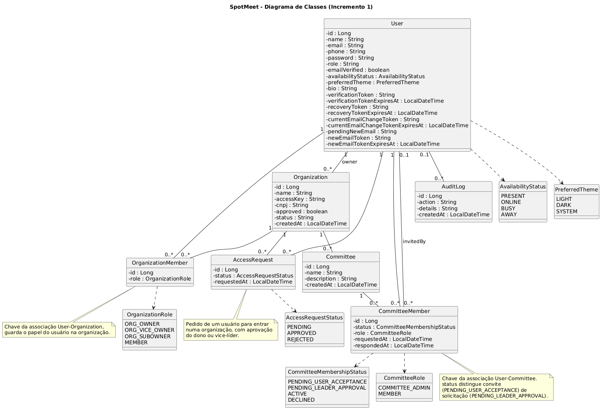

Fonte: próprio autor

### 6.1. Dicionário de dados do diagrama de classes

Os atributos são privados e acessados por métodos get e set. As associações entre as classes estão indicadas no diagrama.

#### Classe `User`

| Atributo | Tipo | Descrição |
|---|---|---|
| id | Long | Identificador único, gerado automaticamente |
| name | String | Nome completo do usuário |
| email | String | E-mail, usado como identificador de login |
| phone | String | Telefone de contato |
| password | String | Hash BCrypt da senha; nunca é devolvido pela API |
| role | String | `USER`, `ADMIN` ou `SYSADMIN`. Padrão `USER` |
| emailVerified | boolean | Indica se o e-mail foi confirmado por OTP. Padrão `false` |
| availabilityStatus | AvailabilityStatus | `PRESENT`, `ONLINE`, `BUSY` ou `AWAY`. Padrão `PRESENT` |
| preferredTheme | PreferredTheme | `LIGHT`, `DARK` ou `SYSTEM`. Padrão `DARK` |
| bio | String | Biografia curta do usuário |
| verificationToken | String | Código OTP de verificação de cadastro |
| verificationTokenExpiresAt | LocalDateTime | Validade do código acima (5 minutos) |
| recoveryToken | String | Código OTP de recuperação de senha |
| recoveryTokenExpiresAt | LocalDateTime | Validade do código acima (5 minutos) |
| currentEmailChangeToken | String | Código OTP da etapa 1 da troca de e-mail (enviado ao e-mail atual) |
| currentEmailChangeTokenExpiresAt | LocalDateTime | Validade do código acima |
| pendingNewEmail | String | Novo e-mail aguardando confirmação na troca em duas etapas |
| newEmailToken | String | Código OTP da etapa 2 da troca de e-mail (enviado ao novo e-mail) |
| newEmailTokenExpiresAt | LocalDateTime | Validade do código acima |

#### Classe `Organization`

| Atributo | Tipo | Descrição |
|---|---|---|
| id | Long | Identificador único |
| name | String | Nome da organização |
| accessKey | String | Chave de acesso, formato `#Nome`, usada para solicitar entrada |
| owner | User | Usuário que criou a organização |
| cnpj | String | CNPJ, opcional; se informado, não pode repetir |
| approved | boolean | Aprovada pelo SysAdmin. Padrão `false` |
| status | String | `PENDING`, `APPROVED`, `REJECTED` ou `BLOCKED`. Padrão `PENDING`, definido no Java (a coluna não tem `NOT NULL`) |
| createdAt | LocalDateTime | Data de criação |

#### Classe `OrganizationMember`

| Atributo | Tipo | Descrição |
|---|---|---|
| id | Long | Identificador único |
| user | User | Membro |
| organization | Organization | Organização |
| role | OrganizationRole | `ORG_OWNER`, `ORG_VICE_OWNER`, `ORG_SUBOWNER` ou `MEMBER`. Padrão `MEMBER` |

#### Classe `AccessRequest`

| Atributo | Tipo | Descrição |
|---|---|---|
| id | Long | Identificador único |
| user | User | Quem solicitou o acesso |
| organization | Organization | Organização alvo |
| status | AccessRequestStatus | `PENDING`, `APPROVED` ou `REJECTED`. Padrão `PENDING` |
| requestedAt | LocalDateTime | Data da solicitação |

#### Classe `Committee`

| Atributo | Tipo | Descrição |
|---|---|---|
| id | Long | Identificador único |
| name | String | Nome da comissão, único dentro da organização |
| description | String | Descrição opcional |
| organization | Organization | Organização à qual pertence |
| createdAt | LocalDateTime | Data de criação, preenchida pelo Java ao salvar |

#### Classe `CommitteeMember`

| Atributo | Tipo | Descrição |
|---|---|---|
| id | Long | Identificador único |
| user | User | Integrante |
| committee | Committee | Comissão |
| status | CommitteeMembershipStatus | `PENDING_USER_ACCEPTANCE` (convite pendente), `PENDING_LEADER_APPROVAL` (solicitação pendente), `ACTIVE` ou `DECLINED`. Padrão `PENDING_USER_ACCEPTANCE` |
| role | CommitteeRole | `COMMITTEE_ADMIN` ou `MEMBER`. Padrão `MEMBER` |
| invitedBy | User | Quem convidou; nulo quando o vínculo nasceu de uma solicitação do próprio membro |
| requestedAt | LocalDateTime | Data do convite ou da solicitação |
| respondedAt | LocalDateTime | Data em que o convite/solicitação foi respondido |

#### Classe `AuditLog`

| Atributo | Tipo | Descrição |
|---|---|---|
| id | Long | Identificador único |
| user | User | Quem executou a ação |
| action | String | Código da ação (ex.: `USER_REGISTERED`, `ORGANIZATION_CREATED`, `ADMIN_SYSTEM_FULL_RESET`) |
| details | String | Texto livre com o detalhe da ação, sem dados sensíveis |
| createdAt | LocalDateTime | Data e hora da ação |

### 6.2. Descrição dos requisitos funcionais

A seguir, descrevem-se os requisitos funcionais de sistema, cada um seguido do seu diagrama de sequência.

#### RF01 – Cadastrar Usuário

| Campo | Descrição |
|---|---|
| Função | Cadastra um novo usuário na plataforma e ativa a sua conta mediante a confirmação do e-mail por código. |
| Descrição | **Cadastro:** insere na tabela users do banco de dados um usuário contendo o nome, o e-mail (normalizado para letras minúsculas) e a senha armazenada como hash BCrypt, com perfil global USER e e-mail não verificado. O sistema gera um código numérico de 6 dígitos, válido por 5 minutos, grava-o no próprio registro do usuário e o envia por e-mail. Caso o e-mail já pertença a uma conta ainda não verificada, o sistema atualiza o nome e a senha dessa conta e gera um novo código.  **Verificação:** confere o código informado com o código gravado para o usuário e, se estiver correto e dentro da validade, marca a conta como verificada (email_verified = true) e apaga o código.  **Reenvio:** gera um novo código de 6 dígitos, com nova validade de 5 minutos, para uma conta cadastrada e ainda não verificada, e o envia por e-mail. |
| Entradas | **Cadastro:** objeto do tipo RegisterRequestDTO contendo name (string obrigatória, não vazia, gravada em coluna de, no máximo, 255 caracteres), email (e-mail válido, obrigatório, gravado em coluna de, no máximo, 255 caracteres) e password (string obrigatória de, no mínimo, 6 caracteres, com pelo menos uma letra maiúscula, uma letra minúscula e um número).  **Verificação:** objeto do tipo VerifyEmailDTO contendo email (e-mail válido, obrigatório) e code (string obrigatória correspondente ao código numérico de 6 dígitos recebido por e-mail).  **Reenvio:** objeto do tipo ResendVerificationDTO contendo email (e-mail válido, obrigatório). |
| Origem | Usuário. |
| Saída | **Cadastro:** resposta HTTP 201 contendo success, message, email, name, channel (EMAIL), delivered e emailVerified (false); quando o envio por SMTP não ocorre, a resposta inclui também devCode (o código gerado) e warning. Em caso de erro, HTTP 409 quando o e-mail já pertence a uma conta verificada e HTTP 400 quando algum campo não atende às validações.  **Verificação:** resposta HTTP 200 contendo success e message; HTTP 400 quando o código está incorreto, expirado ou inexistente.  **Reenvio:** resposta HTTP 200 contendo success, message, channel e delivered, e também devCode e warning quando o envio por SMTP não ocorre. |
| Destino | Usuário, por meio da tela AuthScreen e da caixa de e-mail informada. |
| Ação | **Cadastro:** na tela AuthScreen, no modo de acesso, o usuário seleciona a opção "Cadastre-se". O sistema exibe o formulário "Criar Conta SpotMeet", com os campos Nome completo, E-mail e Senha; enquanto a senha é digitada, o aplicativo indica se ela atende à regra de formato. Ao clicar no botão "Criar Conta", o aplicativo verifica se os três campos foram preenchidos, se o e-mail tem formato válido e se a senha atende à regra, e em caso positivo envia a requisição POST /api/auth/register. O método register da classe AuthController chama o método registerUser da classe UserService, que consulta o usuário pelo e-mail (findByEmail de UserRepository), grava o usuário e o código (save), chama o método sendVerificationEmail da classe EmailService e registra a auditoria. Com a resposta de sucesso, o aplicativo exibe o aviso "Quase pronto!" e passa para o modo de verificação; se a resposta for 409, pergunta ao usuário se deseja fazer login.  **Verificação:** no formulário "Confirmação de Conta", o usuário informa o e-mail cadastrado e o código OTP de 6 dígitos e clica no botão "Confirmar e Ativar Conta". O aplicativo verifica se os dois campos foram preenchidos e envia a requisição POST /api/auth/verify-email. O método verifyEmail da classe AuthController chama o método verifyEmail da classe UserService, que localiza o usuário pelo e-mail (ou, se o e-mail não for encontrado, pelo próprio código, por meio de findByVerificationToken), confere o código e a validade e grava a conta como verificada. Com a resposta de sucesso, o aplicativo exibe o aviso "Sucesso" e retorna ao modo de login.  **Reenvio:** no mesmo formulário, o usuário clica na opção "Reenviar código por E-mail". O aplicativo envia a requisição POST /api/auth/resend-verification, cujo método resendVerification da classe AuthController chama o método resendVerification da classe UserService; após o retorno, a opção fica bloqueada por 60 segundos. |
| Pré-condição | O sistema deve estar em execução. Para o cadastro, o e-mail informado não pode pertencer a uma conta já verificada; para a verificação, o usuário deve ter recebido um código ainda válido. |
| Pós-condição | O sistema deve avisar ao usuário se o cadastro, a verificação ou o reenvio ocorreram com sucesso, ou se houve algum erro. Após a verificação, a conta fica habilitada para o login. |
| Efeitos colaterais | Registro em audit_logs com a ação USER_REGISTERED no cadastro, ACCOUNT_VERIFIED na verificação e VERIFICATION_RESENT no reenvio. Envio de e-mail com o assunto "SpotMeet - Confirmação de Cadastro" contendo o código de verificação, no cadastro e no reenvio. |

**Figura 7 – Diagrama de sequência do RF01**

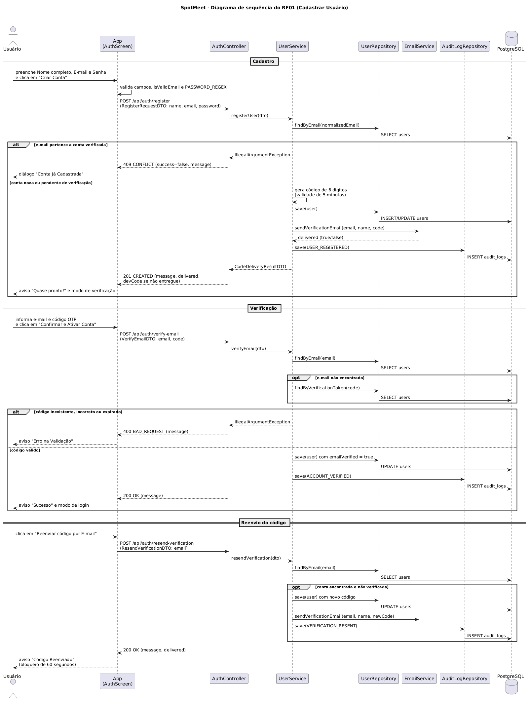

Fonte: próprio autor

#### RF02 – Autenticar Usuário

| Campo | Descrição |
|---|---|
| Função | Autentica um usuário cadastrado e verificado, liberando o acesso às funcionalidades do sistema. |
| Descrição | Consulta na tabela users do banco de dados o usuário com o e-mail informado, compara a senha informada com o hash BCrypt armazenado e verifica se o e-mail da conta já foi confirmado. Em caso positivo, gera um token JWT assinado, contendo o e-mail do usuário e o seu perfil global, com validade definida pela configuração spotmeet.jwt.expiration-ms (86400000 milissegundos, ou 24 horas, por padrão). |
| Entradas | Objeto do tipo LoginRequestDTO contendo email (e-mail válido, obrigatório) e password (string obrigatória, sem regra de formato). |
| Origem | Usuário. |
| Saída | Resposta HTTP 200 com objeto do tipo AuthResponseDTO contendo token, role, name, email, userId e emailVerified. Em caso de erro, HTTP 403 com o código EMAIL_NOT_VERIFIED quando a conta ainda não foi verificada, HTTP 401 com o código BAD_CREDENTIALS quando o e-mail ou a senha estão incorretos, e HTTP 400 quando algum campo não atende às validações. |
| Destino | Usuário, por meio da tela AuthScreen. |
| Ação | O usuário abre o aplicativo, que exibe a tela AuthScreen no modo de acesso, com o cartão "Acessar Conta" e os campos E-mail e Senha. Ao clicar no botão "Entrar no SpotMeet", o aplicativo verifica se os dois campos foram preenchidos e, em caso positivo, envia a requisição POST /api/auth/login com o e-mail convertido para letras minúsculas. O método login da classe AuthController chama o método authenticate do AuthenticationManager, que carrega o usuário pelo método loadUserByUsername da classe UserDetailsServiceImpl (findByEmail de UserRepository), verifica se a conta está habilitada (e-mail verificado) e compara a senha com o hash BCrypt. Autenticado o usuário, o controlador chama o método generateToken da classe JwtUtil e devolve os dados da sessão. O aplicativo guarda a sessão por meio do método signIn do AuthContext e navega para a área principal, que exibe as abas de administração para os perfis ADMIN e SYSADMIN e as abas "Organização" e "Ajustes" para os demais usuários. Se a resposta for EMAIL_NOT_VERIFIED, o aplicativo exibe o aviso "Confirmação Necessária" e passa para o modo de verificação do RF01; nos demais erros, exibe o aviso "Erro no Acesso" com a mensagem recebida. |
| Pré-condição | O sistema deve estar em execução e o usuário deve possuir uma conta cadastrada com o e-mail verificado. |
| Pós-condição | O sistema deve avisar ao usuário se houve algum erro; em caso de sucesso, o usuário passa a acessar a área principal do aplicativo com o token JWT, enviado nas requisições seguintes. |
| Efeitos colaterais | Nenhum. |

**Figura 8 – Diagrama de sequência do RF02**

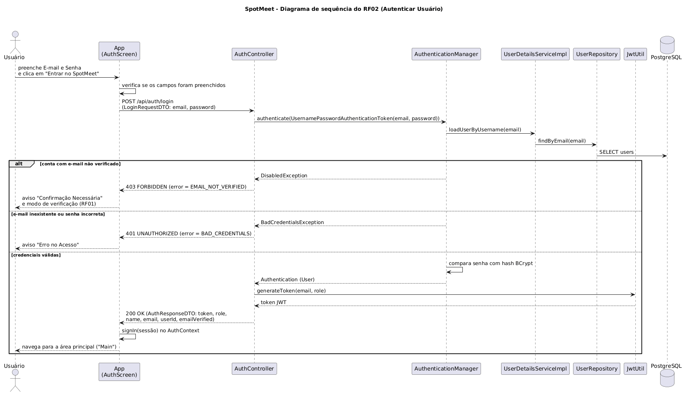

Fonte: próprio autor

#### RF03 – Solicitar Acesso à Organização

| Campo | Descrição |
|---|---|
| Função | Registra o pedido de um usuário autenticado para ingressar em uma organização. |
| Descrição | Localiza na tabela organizations a organização cuja chave de acesso (access_key) é exatamente igual à chave informada, com distinção entre letras maiúsculas e minúsculas, e insere na tabela access_requests uma solicitação com o status PENDING e a data e hora do pedido. Se o usuário já possuir uma solicitação anterior para a mesma organização com o status APPROVED ou REJECTED, essa solicitação é reaberta com o status PENDING e nova data. O servidor não verifica se a organização já foi aprovada pelo administrador do sistema nem se está bloqueada. |
| Entradas | Objeto do tipo AccessRequestDTO contendo accessKey (string obrigatória, correspondente à chave de acesso da organização, gravada em coluna de, no máximo, 100 caracteres). A chave também é aceita no parâmetro de consulta accessKey. O usuário solicitante é identificado pelo e-mail contido no token JWT. |
| Origem | Usuário. |
| Saída | Resposta HTTP 201 com objeto do tipo AccessRequestResponseDTO contendo id, userId, userName, userEmail, organizationId, organizationName, organizationAccessKey, status (PENDING) e requestedAt. Em caso de erro, HTTP 400 quando a chave não é informada, HTTP 404 quando não existe organização com a chave, e HTTP 409 quando o usuário é o proprietário da organização, quando já é membro dela ou quando já possui uma solicitação pendente para ela. |
| Destino | Usuário, por meio da tela OrganizationScreen; a solicitação passa a constar na lista de pedidos pendentes da organização (RF04). |
| Ação | O usuário autenticado seleciona a aba "Organização" e, dentro dela, a aba interna "Entrar". O sistema exibe o cartão "Solicitar Entrada", com o campo "Chave da Organização". O usuário digita a chave e clica no botão "Enviar Solicitação". O aplicativo verifica se a chave começa com "#" e possui ao menos 3 caracteres e, em caso positivo, envia a requisição POST /api/access-requests com a chave no corpo e no parâmetro de consulta. O método requestAccess da classe MembershipController obtém o e-mail do token e chama o método requestAccess da classe MembershipService, que busca a organização (findByAccessKey de OrganizationRepository), busca o solicitante (findByEmail de UserRepository), verifica se ele é o proprietário ou já é membro (existsByUserIdAndOrganizationId de OrganizationMemberRepository), consulta solicitações anteriores (findByUserIdAndOrganizationId de AccessRequestRepository) e grava a solicitação (save). Com a resposta 201, o aplicativo exibe o aviso "Solicitação enviada!" e orienta o usuário a aguardar a aprovação do dono; com a resposta 404, exibe o aviso "Não encontrada"; nos demais erros, exibe o aviso "Atenção" com a mensagem recebida. |
| Pré-condição | O usuário deve estar autenticado no sistema (RF02) e conhecer a chave de acesso da organização. |
| Pós-condição | O sistema deve avisar ao usuário se a solicitação foi registrada com sucesso, ou se houve algum erro. A solicitação registrada fica com o status PENDING até ser avaliada. |
| Efeitos colaterais | Registro em audit_logs com a ação ACCESS_REQUESTED. |

**Figura 9 – Diagrama de sequência do RF03**

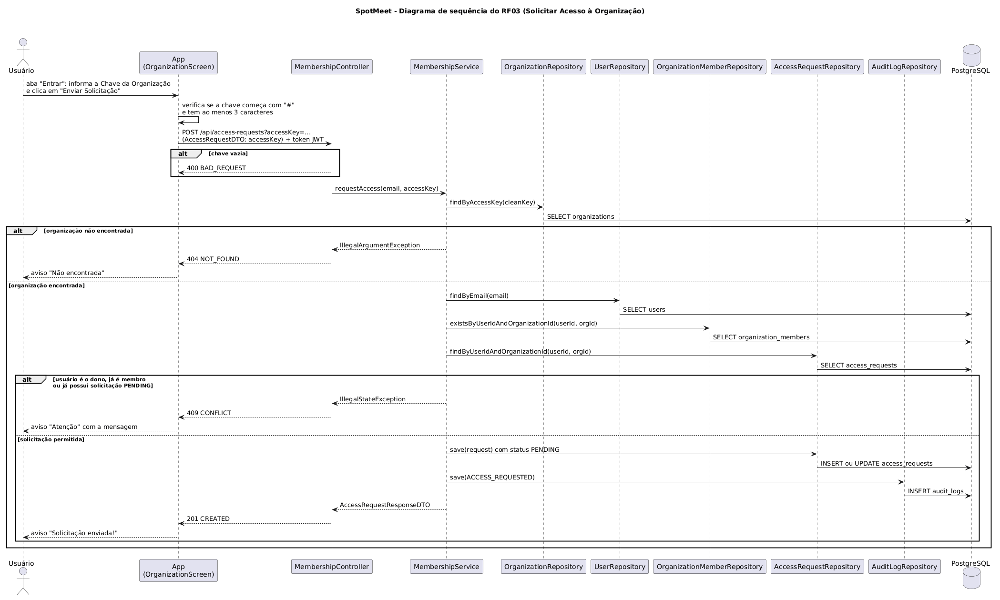

Fonte: próprio autor

#### RF04 – Avaliar Solicitação de Acesso

| Campo | Descrição |
|---|---|
| Função | Permite ao dono ou ao vice-líder da organização consultar os pedidos de entrada pendentes e aprová-los ou rejeitá-los. |
| Descrição | **Pesquisa:** consulta na tabela access_requests as solicitações da organização com o status PENDING.  **Aprovação:** altera para APPROVED o status da solicitação na tabela access_requests e, se o solicitante ainda não for membro, insere na tabela organization_members o vínculo do solicitante com a organização, com o cargo MEMBER.  **Rejeição:** altera para REJECTED o status da solicitação na tabela access_requests.  As três operações são permitidas apenas ao dono da organização (proprietário ou cargo ORG_OWNER), ao vice-líder (cargo ORG_VICE_OWNER) e ao administrador do sistema (perfil SYSADMIN). |
| Entradas | **Pesquisa:** identificador numérico da organização (organizationId), informado na rota.  **Aprovação:** identificador numérico da solicitação (requestId), informado na rota.  **Rejeição:** identificador numérico da solicitação (requestId), informado na rota.  Em todas as operações, o executor é identificado pelo e-mail contido no token JWT. |
| Origem | Usuário (dono ou vice-líder da organização). |
| Saída | **Pesquisa:** resposta HTTP 200 com lista de objetos do tipo AccessRequestResponseDTO; HTTP 403 quando o executor não é dono nem vice-líder.  **Aprovação:** resposta HTTP 200 com objeto do tipo AccessRequestResponseDTO com o status APPROVED; HTTP 404 quando a solicitação não existe, HTTP 409 quando a solicitação não está pendente e HTTP 403 quando o executor não é dono nem vice-líder.  **Rejeição:** resposta HTTP 200 com objeto do tipo AccessRequestResponseDTO com o status REJECTED; HTTP 404, 409 e 403 nas mesmas situações da aprovação. |
| Destino | Usuário, por meio da tela OrganizationScreen. |
| Ação | **Pesquisa:** o dono ou o vice-líder seleciona a aba "Organização" e a aba interna "Gerenciar". Quando o cargo do usuário na organização selecionada é ORG_OWNER ou ORG_VICE_OWNER, o aplicativo envia a requisição GET /api/organizations/{organizationId}/access-requests, cujo método listPendingRequests da classe MembershipController chama o método listPendingRequests da classe MembershipService; este chama requireOwnerOrViceOwner e consulta as solicitações pelo método findByOrganizationIdAndStatus de AccessRequestRepository. O aplicativo exibe o cartão "Pedidos de Entrada na Organização", com o nome e o e-mail de cada solicitante, um botão verde de aprovação (ícone de confirmação) e um botão vermelho de rejeição (ícone de fechar). O cartão não é exibido enquanto a organização estiver pendente de aprovação pelo administrador do sistema, bloqueada ou rejeitada.  **Aprovação:** ao clicar no botão de aprovação, o aplicativo envia a requisição POST /api/access-requests/{requestId}/approve. O método approveAccess da classe MembershipController chama o método approveAccess da classe MembershipService, que busca a solicitação (findById), verifica se ela está pendente, busca o executor (findByEmail), chama requireOwnerOrViceOwner, grava o novo status (save), verifica se o solicitante já é membro (existsByUserIdAndOrganizationId) e, se não for, grava o vínculo com o cargo MEMBER. O aplicativo exibe o aviso "Membro aprovado na organização!" e recarrega os dados.  **Rejeição:** ao clicar no botão de rejeição, o aplicativo envia a requisição POST /api/access-requests/{requestId}/reject. O método rejectAccess da classe MembershipController chama o método rejectAccess da classe MembershipService, que realiza as mesmas verificações da aprovação e grava o status REJECTED. O aplicativo exibe o aviso "Solicitação da organização rejeitada." e recarrega os dados. |
| Pré-condição | O usuário deve estar autenticado (RF02) e ser dono ou vice-líder da organização; para aprovar ou rejeitar, deve existir uma solicitação com o status PENDING (RF03). |
| Pós-condição | O sistema deve avisar ao usuário se a aprovação ou a rejeição ocorreu com sucesso, ou se houve algum erro. Na aprovação, o solicitante passa a constar como membro da organização. |
| Efeitos colaterais | **Pesquisa:** nenhum.  **Aprovação:** registro em audit_logs com a ação ACCESS_APPROVED e inserção do vínculo em organization_members.  **Rejeição:** registro em audit_logs com a ação ACCESS_REJECTED. |

**Figura 10 – Diagrama de sequência do RF04**

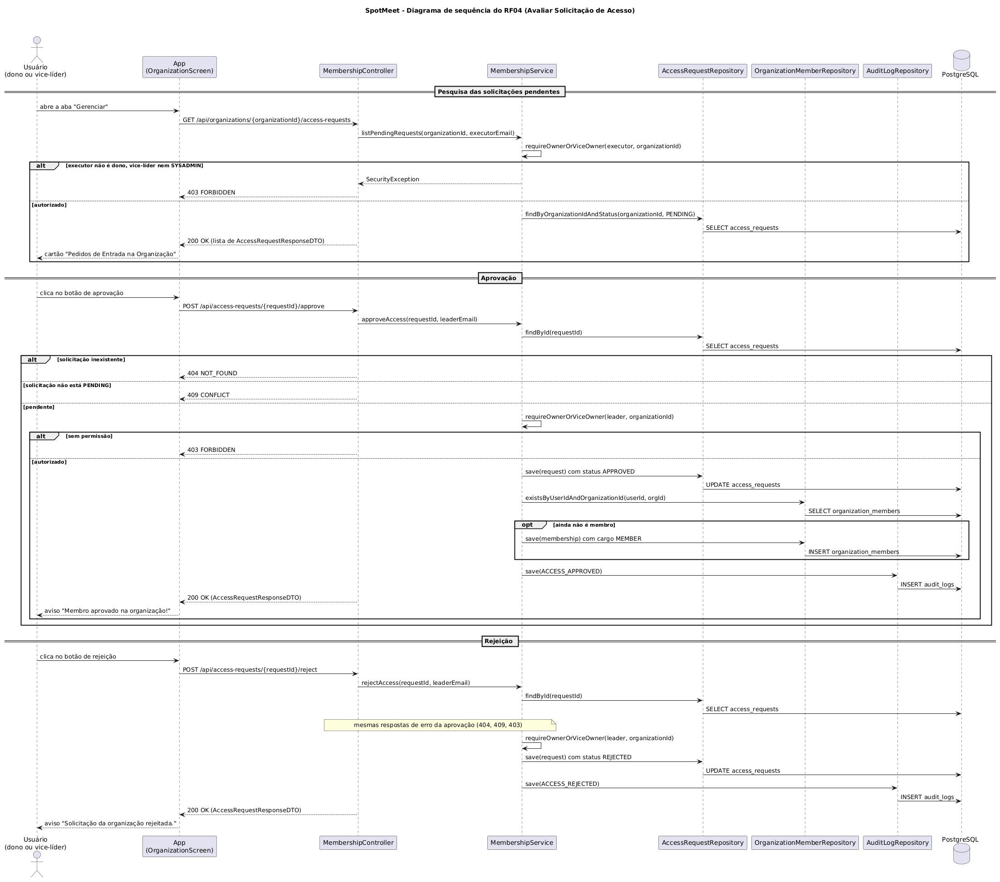

Fonte: próprio autor

#### RF05 – Manter Membros da Organização

| Campo | Descrição |
|---|---|
| Função | Permite consultar os membros de uma organização e, conforme a hierarquia de cargos, promovê-los, rebaixá-los ou revogar o seu acesso. |
| Descrição | **Pesquisa:** consulta na tabela organization_members os vínculos da organização, com o identificador, o nome, o e-mail e o cargo de cada membro.  **Promoção:** altera na tabela organization_members o cargo do membro de MEMBER para ORG_SUBOWNER (permitido ao dono e ao vice-líder) ou de ORG_SUBOWNER para ORG_VICE_OWNER (permitido somente ao dono).  **Rebaixamento:** altera na tabela organization_members o cargo do membro de ORG_VICE_OWNER para ORG_SUBOWNER (permitido somente ao dono) ou de ORG_SUBOWNER para MEMBER (permitido ao dono e ao vice-líder).  **Revogação:** exclui das tabelas committee_members e access_requests os registros do membro relativos à organização e exclui da tabela organization_members o seu vínculo. O subdono pode remover apenas membros comuns; o vice-líder pode remover membros comuns e subdonos; o dono pode remover qualquer integrante; ninguém pode remover o dono nem a si mesmo, e o membro comum não pode remover ninguém.  Em todas as operações, o administrador do sistema (perfil SYSADMIN) tem as mesmas permissões do dono. O cargo do dono (ORG_OWNER) não pode ser alterado. |
| Entradas | **Pesquisa:** identificador numérico da organização (organizationId), informado na rota.  **Promoção:** identificadores numéricos da organização (organizationId) e do usuário membro (userId), informados na rota.  **Rebaixamento:** identificadores numéricos da organização (organizationId) e do usuário membro (userId), informados na rota.  **Revogação:** identificadores numéricos da organização (organizationId) e do usuário membro (memberId), informados na rota.  Em todas as operações, o executor é identificado pelo e-mail contido no token JWT. |
| Origem | Usuário (membro da organização; as alterações exigem cargo de liderança). |
| Saída | **Pesquisa:** resposta HTTP 200 com lista de objetos do tipo MemberDTO (classe interna de OrganizationResponseDTO) contendo userId, name, email e role; HTTP 403 quando o executor não é membro da organização.  **Promoção:** resposta HTTP 200 com objeto do tipo MemberDTO com o novo cargo; HTTP 404 quando o usuário não existe ou não pertence à organização, HTTP 409 quando o alvo é o dono ou já é vice-líder, e HTTP 403 quando o executor não tem permissão.  **Rebaixamento:** resposta HTTP 200 com objeto do tipo MemberDTO com o novo cargo; HTTP 404 quando o usuário não existe ou não pertence à organização, HTTP 409 quando o alvo é o dono ou já é membro comum, e HTTP 403 quando o executor não tem permissão.  **Revogação:** resposta HTTP 200 com a mensagem "Acesso revogado com sucesso."; HTTP 400 quando o executor tenta remover a si mesmo ou ao dono, ou quando a organização ou o membro não existem, e HTTP 403 quando a hierarquia não permite a remoção. |
| Destino | Usuário, por meio da tela OrganizationScreen. |
| Ação | **Pesquisa:** o usuário seleciona a aba "Organização" e a aba interna "Gerenciar". O aplicativo envia a requisição GET /api/organizations/{organizationId}/members, cujo método listMembers da classe MembershipController chama o método listMembers da classe MembershipService; este chama requireOrganizationMember e consulta os vínculos pelo método findByOrganizationId de OrganizationMemberRepository. O aplicativo exibe o cartão "Integrantes Ativos", com o nome, o e-mail e o cargo de cada integrante ("Dono / Líder", "Vice-Líder", "Subdono" ou "Membro") e os botões de ação permitidos ao cargo do usuário.  **Promoção:** o usuário clica no botão com o ícone de seta para cima ao lado do integrante e confirma a operação no diálogo "Confirmar Elevação", pelo botão "Elevar". O aplicativo envia a requisição POST /api/organizations/{organizationId}/members/{userId}/promote; o método promoteMember da classe MembershipController chama o método promoteMember da classe MembershipService, que busca o executor e o alvo (findByEmail e findById de UserRepository), busca o vínculo do alvo (findByUserIdAndOrganizationId), verifica a permissão (requireOwnerOrViceOwner ou requireOwner, conforme o cargo atual do alvo) e grava o novo cargo (save). O aplicativo exibe o aviso "Sucesso" e recarrega os dados.  **Rebaixamento:** o usuário clica no botão com o ícone de seta para baixo e confirma no diálogo "Confirmar Rebaixamento", pelo botão "Rebaixar". O aplicativo envia a requisição POST /api/organizations/{organizationId}/members/{userId}/demote; o método demoteMember da classe MembershipController chama o método demoteMember da classe MembershipService, que realiza as mesmas buscas, verifica a permissão (requireOwner ou requireOwnerOrViceOwner, conforme o cargo atual do alvo) e grava o novo cargo.  **Revogação:** o usuário clica no botão com o ícone de remoção de pessoa e confirma no diálogo "Confirmar", pelo botão "Remover". O aplicativo envia a requisição DELETE /api/organizations/{organizationId}/members/{memberId}; o método revokeAccess da classe MembershipController chama o método revokeAccess da classe MembershipService, que verifica se o alvo não é o próprio executor nem o dono, busca o vínculo do alvo e o cargo do executor, aplica as regras de hierarquia, exclui os vínculos do membro com as comissões da organização (findByUserIdAndCommitteeOrganizationId e deleteAll de CommitteeMemberRepository), exclui as suas solicitações de acesso à organização (findByUserIdAndOrganizationId e deleteAll de AccessRequestRepository) e exclui o vínculo com a organização (delete). O aplicativo exibe o aviso "Acesso do membro revogado da organização." e recarrega os dados. |
| Pré-condição | O usuário deve estar autenticado (RF02) e ser membro da organização; para promover, rebaixar ou revogar, deve possuir o cargo exigido pela hierarquia em relação ao cargo do alvo. |
| Pós-condição | O sistema deve avisar ao usuário se a operação ocorreu com sucesso, ou se houve algum erro. |
| Efeitos colaterais | **Pesquisa:** nenhum.  **Promoção:** registro em audit_logs com a ação ROLE_PROMOTED_SUBOWNER ou ROLE_PROMOTED_VICE_OWNER.  **Rebaixamento:** registro em audit_logs com a ação ROLE_DEMOTED_SUBOWNER ou ROLE_DEMOTED_MEMBER.  **Revogação:** registro em audit_logs com a ação ACCESS_REVOKED; exclusão dos vínculos do membro com as comissões da organização e das suas solicitações de acesso à organização. |

**Figura 11 – Diagrama de sequência do RF05**

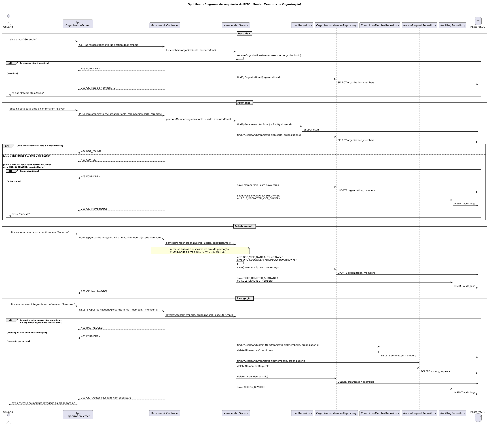

Fonte: próprio autor

#### RF06 – Cadastrar Organização

| Campo | Descrição |
|---|---|
| Função | Insere uma nova organização no banco de dados. |
| Descrição | Insere na tabela organizations do banco de dados uma organização contendo o nome, a chave de acesso e, opcionalmente, o CNPJ fornecidos pelo usuário do sistema. O usuário que realiza o cadastro torna-se o dono da organização e é registrado na tabela organization_members com o papel ORG_OWNER. A organização é gravada com o campo approved igual a false e o campo status igual a PENDING, aguardando a análise do Administrador do sistema (RF08). |
| Entradas | Objeto do tipo OrganizationRequestDTO contendo: name, string obrigatória (@NotBlank), sem limite de tamanho no DTO, gravada na coluna name da tabela organizations, que não define tamanho e assume o padrão de 255 caracteres; accessKey, string obrigatória (@NotBlank) no formato #Nome, composta pelo caractere "#" seguido de 2 a 50 caracteres alfanuméricos, "_" ou "-" (@Pattern `^#[A-Za-z0-9_\-]{2,50}$`), gravada exatamente como informada e com diferenciação entre maiúsculas e minúsculas; cnpj, string opcional, sem validação de formato nem de tamanho. O e-mail do dono é obtido do token JWT, e não do corpo da requisição. |
| Origem | Usuário. |
| Saída | Objeto do tipo OrganizationResponseDTO contendo id, name, accessKey, ownerId, ownerName, createdAt, approved e status, sem o CNPJ, com o código HTTP 201 (Created). |
| Destino | Usuário, por meio da tela OrganizationScreen. |
| Ação | O usuário indica o desejo de cadastrar uma nova organização selecionando a aba "Organização" da barra inferior do aplicativo, que exibe a tela OrganizationScreen ("Gestão de Organizações"), e, nela, a aba interna "Criar". O sistema exibe o cartão "Criar Organização", solicitando que o usuário digite o "Nome da Organização" e a "Chave de Acesso". Ao clicar no botão "Criar Organização", o aplicativo verifica se o nome foi digitado e se a chave atende ao formato exigido e, em caso positivo, envia a requisição POST /api/organizations com os campos name e accessKey. No servidor, o método createOrganization da classe OrganizationController obtém o e-mail do usuário autenticado e chama o método createOrganization(ownerEmail, dto) da classe OrganizationService, que remove os espaços das extremidades do nome e da chave, verifica por meio de existsByAccessKey se a chave já está em uso, localiza o dono por meio de findByEmail, grava a organização como pendente, grava o vínculo ORG_OWNER do dono e registra a auditoria. Em caso de sucesso, o aplicativo exibe a mensagem de sucesso com a chave de acesso e passa para a aba "Gerenciar", na qual a organização aparece com o aviso "Organização Pendente de Aprovação". |
| Pré-condição | O usuário deve estar autenticado no sistema com um token JWT válido. |
| Pós-condição | O sistema deve avisar ao usuário se a organização foi cadastrada com sucesso, ficando pendente de aprovação, ou se houve algum erro: dados inválidos (400), chave já em uso (409) ou usuário autenticado não encontrado (409). |
| Efeitos colaterais | Inserção de um registro na tabela organization_members com o papel ORG_OWNER para o usuário que realizou o cadastro e registro em audit_logs com a ação ORGANIZATION_CREATED, contendo o nome, a chave e o identificador da organização. |

**Figura 12 – Diagrama de sequência do RF06**

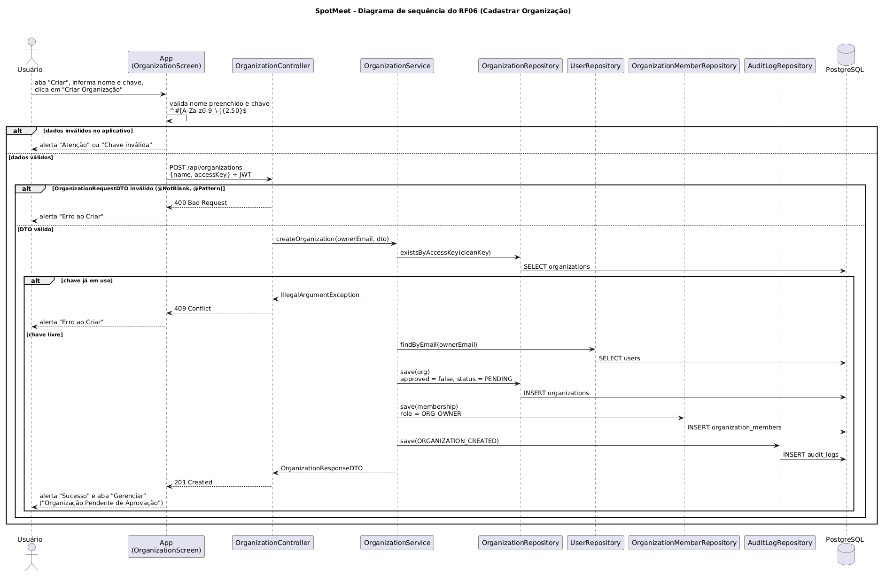

Fonte: próprio autor

#### RF07 – Manter Organização

| Campo | Descrição |
|---|---|
| Função | **Pesquisa:** lista as organizações às quais o usuário está vinculado.  **Atualização:** altera o nome, a chave de acesso e o CNPJ de uma organização.  **Exclusão:** remove permanentemente uma organização e os dados vinculados a ela. |
| Descrição | **Pesquisa:** consulta na tabela organization_members os vínculos do usuário autenticado e devolve as organizações correspondentes, informando o papel do usuário em cada uma delas (myRole).  **Atualização:** atualiza na tabela organizations o nome, a chave de acesso e, quando informado, o CNPJ da organização indicada. Os campos approved, status e owner_id não são alterados por esta operação.  **Exclusão:** exclui da tabela organizations a organização indicada, após excluir, por código e nesta ordem, os registros de committee_members de cada comissão, os registros de committees, os registros de access_requests e os registros de organization_members vinculados à organização. |
| Entradas | **Pesquisa:** nenhuma entrada além do e-mail do usuário, obtido do token JWT.  **Atualização:** identificador organizationId (Long) na rota e objeto do tipo OrganizationRequestDTO contendo: name, string obrigatória (@NotBlank), sem limite de tamanho no DTO, gravada na coluna name, de 255 caracteres por padrão; accessKey, string obrigatória no formato #Nome, composta por "#" seguido de 2 a 50 caracteres alfanuméricos, "_" ou "-" (@Pattern `^#[A-Za-z0-9_\-]{2,50}$`), com diferenciação entre maiúsculas e minúsculas; cnpj, string opcional, sem validação de formato, em que o valor nulo mantém o CNPJ gravado e o valor em branco apaga o CNPJ.  **Exclusão:** identificador organizationId (Long) na rota. |
| Origem | Usuário. |
| Saída | **Pesquisa:** lista de objetos do tipo OrganizationResponseDTO (id, name, accessKey, ownerId, ownerName, createdAt, myRole, approved e status), com o código HTTP 200.  **Atualização:** objeto do tipo OrganizationResponseDTO com os dados atualizados, com o código HTTP 200.  **Exclusão:** mensagem "Organizacao excluida com sucesso.", com o código HTTP 200. |
| Destino | Usuário, por meio da tela OrganizationScreen. |
| Ação | **Pesquisa:** sempre que a tela OrganizationScreen ("Gestão de Organizações") recebe o foco, o aplicativo envia a requisição GET /api/organizations/mine. O método listMyOrganizations da classe OrganizationController chama o método listMyOrganizations(userEmail) da classe OrganizationService, que localiza o usuário por meio de findByEmail e obtém seus vínculos por meio de findByUserId. As organizações são exibidas na seção "Suas Organizações" da aba "Entrar" e como opções de seleção na aba "Gerenciar".  **Atualização:** na aba "Gerenciar", o dono ou o vice-líder seleciona a organização e clica no ícone de edição do cartão da organização. O sistema exibe o formulário com os campos "Nome da Organização" e "Chave de Acesso" preenchidos com os valores atuais. Ao clicar no botão "Salvar Alterações", o aplicativo verifica se o nome foi digitado e se a chave atende ao formato exigido e, em caso positivo, envia a requisição PUT /api/organizations/{organizationId} com os campos name e accessKey. O método updateOrganization da classe OrganizationController chama o método updateOrganization(organizationId, executorEmail, dto) da classe OrganizationService, que localiza o executor e a organização, verifica a permissão, verifica por meio de findByAccessKey se a nova chave pertence a outra organização, grava as alterações e registra a auditoria. Caso a chave tenha sido alterada, o aplicativo informa que a chave anterior deixa de funcionar para novas solicitações.  **Exclusão:** na aba "Gerenciar", o dono ou o vice-líder clica no botão "APAGAR TODA A ORGANIZAÇÃO" do cartão "Zona de Perigo" ou, quando a organização está pendente ou bloqueada, no botão "Excluir Organização". O sistema solicita a confirmação e, ao clicar em "APAGAR ORGANIZAÇÃO", envia a requisição DELETE /api/organizations/{organizationId}. O método deleteOrganization da classe OrganizationController chama o método deleteOrganization(organizationId, executorEmail) da classe OrganizationService, que verifica a permissão, exclui os dados vinculados, exclui a organização e registra a auditoria. |
| Pré-condição | **Pesquisa:** o usuário deve estar autenticado no sistema.  **Atualização:** o usuário deve estar autenticado e ser dono (ORG_OWNER) ou vice-líder (ORG_VICE_OWNER) da organização, ou possuir o papel global SYSADMIN.  **Exclusão:** o usuário deve estar autenticado e ser dono (ORG_OWNER) ou vice-líder (ORG_VICE_OWNER) da organização, ou possuir o papel global SYSADMIN. |
| Pós-condição | **Pesquisa:** o sistema deve exibir as organizações do usuário ou, se não houver nenhuma, a tela de gestão vazia.  **Atualização:** o sistema deve avisar ao usuário se a alteração ocorreu com sucesso ou se houve algum erro: dados inválidos (400), acesso negado (403), chave em uso por outra organização ou organização não encontrada (409).  **Exclusão:** o sistema deve avisar ao usuário se a exclusão ocorreu com sucesso ou se houve algum erro: acesso negado (403) ou organização não encontrada (409). |
| Efeitos colaterais | **Pesquisa:** nenhum.  **Atualização:** registro em audit_logs com a ação ORGANIZATION_UPDATED, contendo o nome e a chave anteriores e novos; a chave anterior deixa de localizar a organização nas novas solicitações de acesso.  **Exclusão:** exclusão em cascata, realizada pelo código, dos registros de committee_members, committees, access_requests e organization_members vinculados à organização, e registro em audit_logs com a ação ORGANIZATION_DELETED, contendo o identificador, o nome e a chave da organização excluída. |

**Figura 13 – Diagrama de sequência do RF07**

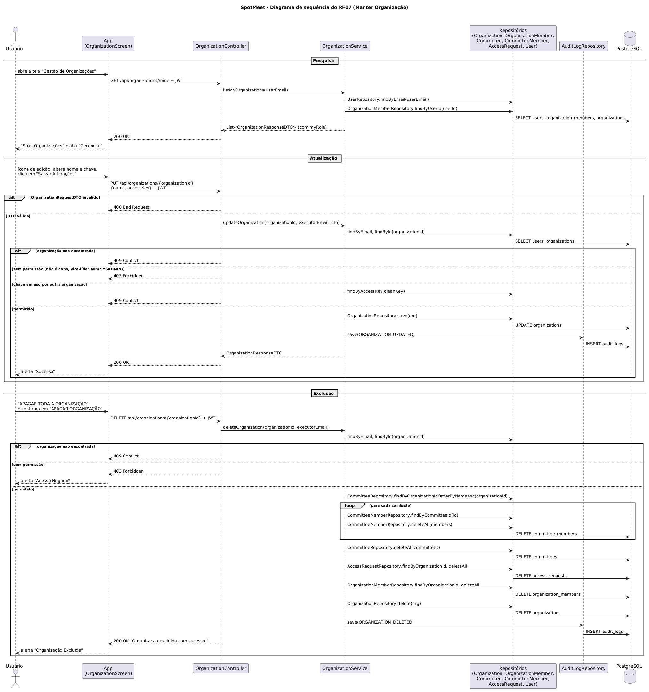

Fonte: próprio autor

#### RF08 – Gerenciar Organizações

| Campo | Descrição |
|---|---|
| Função | **Pesquisa:** lista todas as organizações cadastradas no sistema.  **Pesquisa de pendentes:** lista as organizações que aguardam aprovação.  **Aprovação:** autoriza o cadastro de uma organização.  **Rejeição:** recusa o cadastro de uma organização.  **Alteração de status:** aprova ou bloqueia uma organização já cadastrada. |
| Descrição | **Pesquisa:** consulta a tabela organizations, com o dono carregado na mesma consulta, e devolve os dados de cada organização com o e-mail do dono e o CNPJ mascarados, além da quantidade de membros e de comissões.  **Pesquisa de pendentes:** realiza a mesma consulta e devolve somente as organizações com approved igual a false e status igual a PENDING ou nulo.  **Aprovação:** atualiza na tabela organizations o campo approved para true e o campo status para APPROVED.  **Rejeição:** atualiza na tabela organizations o campo approved para false e o campo status para REJECTED.  **Alteração de status:** atualiza na tabela organizations o campo approved com o valor informado e o campo status para APPROVED, quando approved é true, ou BLOCKED, quando approved é false. |
| Entradas | **Pesquisa e Pesquisa de pendentes:** nenhuma entrada além do e-mail do administrador, obtido do token JWT.  **Aprovação:** identificador id (Long) na rota.  **Rejeição:** identificador id (Long) na rota e corpo opcional do tipo Map&lt;String, String&gt; com a chave reason, string sem limite de tamanho definido.  **Alteração de status:** identificador id (Long) na rota e objeto do tipo UpdateOrganizationStatusDTO contendo approved, valor lógico obrigatório (@NotNull), e justification, string opcional sem limite de tamanho definido. |
| Origem | Administrador do sistema. |
| Saída | **Pesquisa e Pesquisa de pendentes:** lista de objetos do tipo AdminOrganizationDTO (id, name, accessKey, ownerId, ownerName, ownerEmailMasked, cnpjMasked, approved, status, createdAt, totalMembers e totalCommittees), com o código HTTP 200.  **Aprovação, Rejeição e Alteração de status:** objeto do tipo AdminOrganizationDTO com os dados atualizados da organização, com o código HTTP 200. |
| Destino | Administrador do sistema, por meio da tela AdminOrganizationsScreen. |
| Ação | **Pesquisa e Pesquisa de pendentes:** o administrador seleciona a aba "Aprovações" ou a aba "Organizações" da barra inferior do aplicativo, que exibem a tela AdminOrganizationsScreen ("Gestão de Organizações", "Painel Unificado do SysAdmin") com os seletores "Pendentes LGPD" e "Todas", respectivamente. Ao receber o foco, e a cada 4 segundos enquanto permanece em foco, a tela envia em paralelo as requisições GET /api/admin/organizations e GET /api/admin/organizations/pending. Os métodos listOrganizations e listPendingOrganizations da classe AdminController chamam, respectivamente, os métodos listOrganizations(executorEmail) e listPendingOrganizations(executorEmail) da classe AdminService, que validam o papel do executor por meio de validateSysAdmin e obtêm as organizações por meio de findAllWithOwner. A lista pode ser filtrada no campo "Buscar por nome, #chave ou responsável...".  **Aprovação:** no seletor "Pendentes LGPD", o administrador clica no botão "Aprovar" da organização e confirma a ação em "Confirmar Aprovação". O aplicativo envia a requisição POST /api/admin/organizations/{id}/approve, e o método approveOrganization da classe AdminController chama o método approveOrganization(orgId, executorEmail) da classe AdminService.  **Rejeição:** no seletor "Pendentes LGPD", o administrador clica no botão "Recusar" e confirma a ação em "Confirmar Recusa". O aplicativo envia a requisição POST /api/admin/organizations/{id}/reject com o motivo "Rejeitada pela moderação do SysAdmin", e o método rejectOrganization da classe AdminController chama o método rejectOrganization(orgId, reason, executorEmail) da classe AdminService.  **Alteração de status:** no seletor "Todas", o administrador clica no botão "Bloquear Organização", para uma organização aprovada, ou "Aprovar / Ativar Organização", para as demais, e confirma a ação em "Confirmar Ação". O aplicativo envia a requisição PATCH /api/admin/organizations/{id}/status com approved e a justificativa "Alteração executada via Painel SysAdmin Unificado", e o método updateOrganizationStatus da classe AdminController chama o método updateOrganizationStatus(orgId, approved, justification, executorEmail) da classe AdminService. |
| Pré-condição | O usuário deve estar autenticado no sistema com o papel global ADMIN ou SYSADMIN. Para a Aprovação, a Rejeição e a Alteração de status, a organização indicada deve existir. |
| Pós-condição | **Pesquisa e Pesquisa de pendentes:** o sistema deve exibir a lista de organizações ou, em caso de acesso negado (403), avisar que é necessária a permissão de Administrador.  **Aprovação, Rejeição e Alteração de status:** o sistema deve avisar ao administrador se a operação ocorreu com sucesso ou se houve algum erro: dados inválidos (400, somente na Alteração de status), acesso negado (403), organização não encontrada (404) ou erro interno (500). |
| Efeitos colaterais | **Pesquisa:** registro em audit_logs com a ação ADMIN_ORGANIZATIONS_LISTED.  **Pesquisa de pendentes:** registro em audit_logs com a ação ADMIN_PENDING_ORGANIZATIONS_LISTED.  **Aprovação:** registro em audit_logs com a ação ADMIN_ORGANIZATION_APPROVED.  **Rejeição:** registro em audit_logs com a ação ADMIN_ORGANIZATION_REJECTED, incluindo o motivo, quando informado.  **Alteração de status:** registro em audit_logs com a ação ADMIN_ORGANIZATION_STATUS_CHANGED, incluindo o novo status e a justificativa, quando informada.  Em todas as operações, uma falha na gravação da auditoria é ignorada e não impede a resposta. |

**Figura 14 – Diagrama de sequência do RF08**

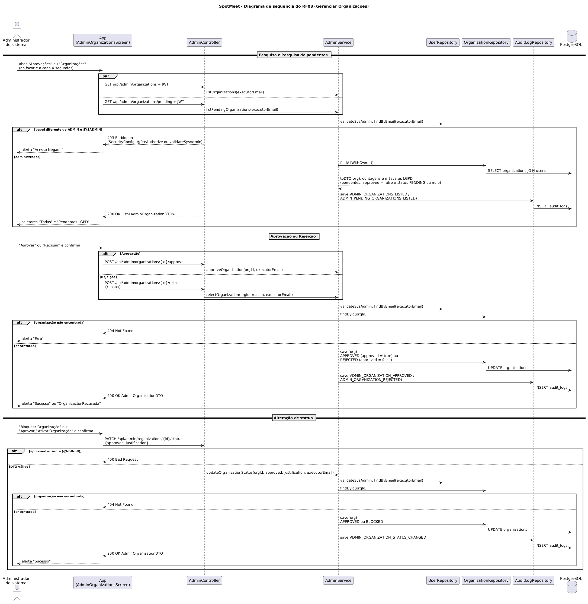

Fonte: próprio autor

#### RF09 – Cadastrar Comissão

| Campo | Descrição |
|---|---|
| Função | Insere uma nova comissão (grupo de trabalho) em uma organização. |
| Descrição | Insere na tabela committees do banco de dados uma comissão vinculada à organização selecionada, contendo o nome e a descrição fornecidos pelo administrador da organização. O nome da comissão deve ser único dentro da mesma organização, regra verificada pelo serviço e garantida pela restrição de unicidade uq_committee_org_name (colunas organization_id e name). |
| Entradas | Identificador da organização (organizationId, do tipo Long), informado na rota, e objeto do tipo CommitteeRequestDTO contendo: name, string obrigatória de 2 a 50 caracteres, formada apenas por letras sem acento, números, "_" ou "-", sem espaços (expressão regular ^[A-Za-z0-9_-]{2,50}$); e description, string opcional de, no máximo, 500 caracteres. |
| Origem | Usuário (administrador da organização). |
| Saída | Objeto do tipo CommitteeResponseDTO contendo id, name, description, organizationId, organizationName, totalActiveMembers, totalPending e createdAt, com código HTTP 201 (Created); ou mensagem de erro. |
| Destino | Aplicativo (tela OrganizationScreen), que exibe a mensagem ao usuário e atualiza a lista de comissões. |
| Ação | O usuário acessa a aba "Gerenciar" da tela de gestão de organizações (OrganizationScreen) e, na seção "Comissões", seleciona o botão "+ Nova Comissão", exibido apenas para dono, vice-líder e subdono. O sistema exibe um formulário com os campos "Nome da Comissão (sem espaços)" e "Descrição (opcional)". Ao clicar no botão "Criar Comissão", o aplicativo verifica se o nome foi digitado, se não contém espaços e se atende ao formato de 2 a 50 caracteres permitidos; em caso positivo, envia uma requisição POST para /api/organizations/{organizationId}/committees, tratada pelo método createCommittee da classe CommitteeController, que valida o CommitteeRequestDTO e chama o método createCommittee(organizationId, leaderEmail, dto) da classe CommitteeService. O serviço verifica, por meio do método requireOrganizationLeader, se o usuário é líder da organização, remove os espaços das extremidades do nome, consulta o método existsByOrganizationIdAndName da classe CommitteeRepository para verificar se já existe comissão com o mesmo nome na organização e, em caso negativo, grava a nova comissão pelo método save da mesma classe. |
| Pré-condição | O usuário deve estar autenticado e ser dono, vice-líder ou subdono da organização, ou administrador do sistema (papel SYSADMIN). |
| Pós-condição | O sistema deve exibir a mensagem "Comissão "nome" criada com sucesso!" ou a mensagem de erro retornada pelo servidor: código 400 para dados inválidos, 403 para usuário sem permissão e 409 para nome já existente na organização ou organização não encontrada. |
| Efeitos colaterais | Registro na tabela audit_logs com a ação COMMITTEE_CREATED, contendo o nome da comissão, o nome da organização e o identificador gerado. |

**Figura 15 – Diagrama de sequência do RF09**

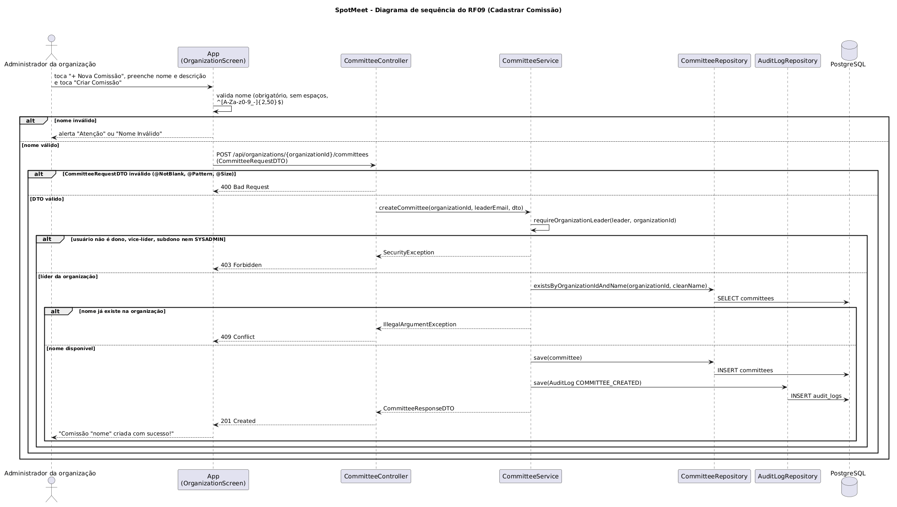

Fonte: próprio autor

#### RF10 – Manter Comissão

| Campo | Descrição |
|---|---|
| Função | **Pesquisa:** Lista as comissões de uma organização.  **Atualização:** Altera o nome e a descrição de uma comissão.  **Exclusão:** Remove uma comissão e todos os seus vínculos. |
| Descrição | **Pesquisa:** Consulta na tabela committees as comissões da organização, em ordem alfabética de nome, e conta na tabela committee_members os vínculos ativos (ACTIVE) e pendentes (PENDING_USER_ACCEPTANCE e PENDING_LEADER_APPROVAL) de cada comissão.  **Atualização:** Atualiza na tabela committees o nome e a descrição da comissão selecionada, mantendo a organização à qual ela pertence e a unicidade do nome dentro da organização.  **Exclusão:** Remove da tabela committee_members todos os vínculos da comissão e, em seguida, remove a comissão da tabela committees. |
| Entradas | **Pesquisa:** Identificador da organização (organizationId, do tipo Long), informado na rota.  **Atualização:** Identificador da comissão (committeeId, do tipo Long), informado na rota, e objeto do tipo CommitteeRequestDTO contendo name, string obrigatória de 2 a 50 caracteres, formada apenas por letras sem acento, números, "_" ou "-" (expressão regular ^[A-Za-z0-9_-]{2,50}$), e description, string opcional de, no máximo, 500 caracteres.  **Exclusão:** Identificador da comissão (committeeId, do tipo Long), informado na rota. |
| Origem | **Pesquisa:** Usuário (integrante da organização).  **Atualização:** Usuário (administrador da organização).  **Exclusão:** Usuário (administrador da organização). |
| Saída | **Pesquisa:** Lista de objetos do tipo CommitteeResponseDTO (id, name, description, organizationId, organizationName, totalActiveMembers, totalPending e createdAt), com código HTTP 200.  **Atualização:** Objeto do tipo CommitteeResponseDTO com os dados atualizados, com código HTTP 200; ou mensagem de erro.  **Exclusão:** Texto "Comissao excluida com sucesso.", com código HTTP 200; ou mensagem de erro. |
| Destino | Aplicativo (tela OrganizationScreen). |
| Ação | **Pesquisa:** Ao acessar a aba "Gerenciar" da tela OrganizationScreen com uma organização selecionada, o aplicativo envia uma requisição GET para /api/organizations/{organizationId}/committees, tratada pelo método listCommittees da classe CommitteeController, que chama o método listCommittees(organizationId, userEmail) da classe CommitteeService. O serviço verifica, pelo método existsByUserIdAndOrganizationId da classe OrganizationMemberRepository, se o usuário pertence à organização, obtém as comissões pelo método findByOrganizationIdOrderByNameAsc da classe CommitteeRepository e conta os vínculos pelo método countByCommitteeIdAndStatus da classe CommitteeMemberRepository. A seção "Comissões" exibe, para cada comissão, o nome, a descrição, a quantidade de integrantes ativos e, quando houver, a quantidade de pendentes.  **Atualização:** O usuário seleciona o botão de edição (ícone de lápis) de uma comissão na seção "Comissões", exibido para dono, vice-líder e subdono. O sistema exibe o formulário preenchido com os dados atuais e a indicação "Editando a comissão selecionada.". Ao clicar no botão "Salvar Alterações", o aplicativo verifica se o nome atende ao formato permitido e envia uma requisição PUT para /api/committees/{committeeId}, tratada pelo método updateCommittee da classe CommitteeController, que chama o método updateCommittee(committeeId, leaderEmail, dto) da classe CommitteeService. O serviço localiza a comissão pelo método findById, verifica pelo método requireOrganizationLeader se o usuário é líder da organização da comissão, verifica pelo método findByOrganizationIdAndName se outra comissão da mesma organização já usa o nome informado e grava as alterações pelo método save da classe CommitteeRepository.  **Exclusão:** O usuário seleciona o botão de exclusão (ícone de lixeira) de uma comissão na seção "Comissões", exibido pelo aplicativo apenas para dono e vice-líder. O sistema solicita confirmação ("Excluir a comissão "nome" e todos os seus vínculos?" na versão web; diálogo "Confirmar Exclusão" com os botões "Cancelar" e "Excluir" nas versões Android e iOS). Após a confirmação, o aplicativo envia uma requisição DELETE para /api/committees/{committeeId}, tratada pelo método deleteCommittee da classe CommitteeController, que chama o método deleteCommittee(committeeId, leaderEmail) da classe CommitteeService. O serviço localiza a comissão, verifica pelo método requireOrganizationLeader se o usuário é líder da organização, obtém os vínculos pelo método findByCommitteeId e os remove pelo método deleteAll da classe CommitteeMemberRepository e remove a comissão pelo método delete da classe CommitteeRepository. |
| Pré-condição | **Pesquisa:** O usuário deve estar autenticado e ser integrante da organização, ou administrador do sistema (papel SYSADMIN).  **Atualização:** O usuário deve estar autenticado e ser dono, vice-líder ou subdono da organização da comissão, ou administrador do sistema (papel SYSADMIN).  **Exclusão:** O usuário deve estar autenticado e ser dono, vice-líder ou subdono da organização da comissão, ou administrador do sistema (papel SYSADMIN). |
| Pós-condição | **Pesquisa:** O sistema deve exibir a lista de comissões da organização ou o texto "Nenhuma comissão cadastrada.".  **Atualização:** O sistema deve exibir a mensagem "Comissão "nome" atualizada." ou a mensagem de erro retornada pelo servidor: código 400 para dados inválidos, 403 para usuário sem permissão e 409 para nome já usado por outra comissão da organização ou comissão não encontrada.  **Exclusão:** O sistema deve exibir a mensagem "Comissão "nome" excluída." ou a mensagem de erro retornada pelo servidor: código 403 para usuário sem permissão e 409 para comissão não encontrada. |
| Efeitos colaterais | **Pesquisa:** Nenhum.  **Atualização:** Registro na tabela audit_logs com a ação COMMITTEE_UPDATED, contendo o identificador da comissão, o nome anterior, o novo nome e o nome da organização.  **Exclusão:** Remoção de todos os vínculos da comissão na tabela committee_members, inclusive convites e solicitações pendentes, e registro na tabela audit_logs com a ação COMMITTEE_DELETED, contendo o identificador, o nome da comissão e o nome da organização. |

**Figura 16 – Diagrama de sequência do RF10**

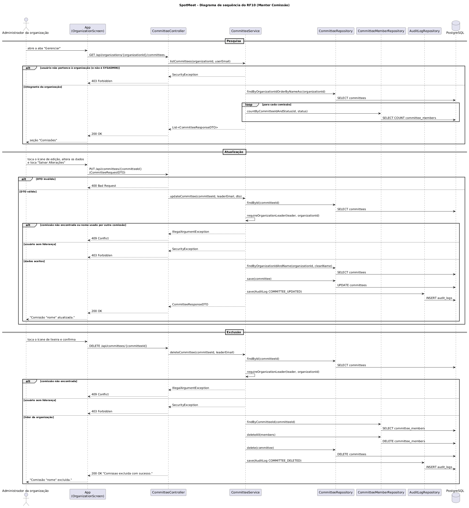

Fonte: próprio autor

#### RF11 – Convidar Membro para Comissão

| Campo | Descrição |
|---|---|
| Função | **Convite:** Vincula um integrante da organização a uma comissão por iniciativa do administrador da organização.  **Consulta de convites:** Lista os convites de comissão pendentes do usuário autenticado.  **Resposta ao convite:** Registra o aceite ou a recusa do convite pelo integrante convidado. |
| Descrição | **Convite:** Insere na tabela committee_members um vínculo do integrante com a comissão, com situação PENDING_USER_ACCEPTANCE, papel MEMBER e o administrador que convidou (invited_by_id). Quando já existe vínculo com situação PENDING_LEADER_APPROVAL (o integrante havia solicitado entrada), o vínculo é alterado diretamente para ACTIVE. Quando já existe vínculo com situação DECLINED, o vínculo é reaberto com situação PENDING_USER_ACCEPTANCE.  **Consulta de convites:** Consulta na tabela committee_members os vínculos do usuário autenticado com situação PENDING_USER_ACCEPTANCE.  **Resposta ao convite:** Atualiza na tabela committee_members a situação do vínculo para ACTIVE, em caso de aceite, ou para DECLINED, em caso de recusa, registrando a data da resposta (responded_at). |
| Entradas | **Convite:** Identificador da comissão (committeeId, do tipo Long) e identificador do integrante convidado (userId, do tipo Long), informados na rota.  **Consulta de convites:** Nenhuma, além do token de autenticação do usuário.  **Resposta ao convite:** Identificador da comissão (committeeId, do tipo Long), informado na rota, e parâmetro accept, do tipo boolean (true para aceitar, false para recusar). |
| Origem | **Convite:** Usuário (administrador da organização).  **Consulta de convites:** Usuário (integrante convidado).  **Resposta ao convite:** Usuário (integrante convidado). |
| Saída | **Convite:** Objeto do tipo CommitteeMemberResponseDTO (id, userId, userName, userEmail, committeeId, committeeName, organizationId, status, role, requestedAt, respondedAt e invitedByName), com código HTTP 201 (Created); ou mensagem de erro.  **Consulta de convites:** Lista de objetos do tipo CommitteeMemberResponseDTO, com código HTTP 200.  **Resposta ao convite:** Objeto do tipo CommitteeMemberResponseDTO com a nova situação, com código HTTP 200; ou mensagem de erro. |
| Destino | Aplicativo (tela OrganizationScreen). |
| Ação | **Convite:** Na seção "Integrantes Ativos" da aba "Gerenciar" da tela OrganizationScreen, o usuário seleciona o botão de comissões (ícone de camadas) de um integrante. O sistema abre a janela "Comissões do Integrante", que lista todas as comissões da organização com a situação do integrante em cada uma (RF13). Para as comissões com a indicação "Não vinculado" ou "Solicitou entrada", o sistema exibe o botão "Adicionar". Ao clicar nesse botão, o aplicativo envia uma requisição POST para /api/committees/{committeeId}/members/{userId}, tratada pelo método addUserToCommittee da classe CommitteeController, que chama o método addUserToCommittee(committeeId, targetUserId, leaderEmail) da classe CommitteeService. O serviço localiza a comissão pelo método findById da classe CommitteeRepository, verifica pelo método requireOrganizationLeader se o usuário é líder da organização, localiza o integrante pelo método findById da classe UserRepository, verifica pelo método existsByUserIdAndOrganizationId da classe OrganizationMemberRepository se ele pertence à organização e consulta o vínculo existente pelo método findByUserIdAndCommitteeId da classe CommitteeMemberRepository. Em seguida, cria ou altera o vínculo conforme descrito e o grava pelo método save.  **Consulta de convites:** Ao acessar a tela OrganizationScreen, o aplicativo envia uma requisição GET para /api/committees/invitations, tratada pelo método listMyInvitations da classe CommitteeController, que chama o método listMyInvitations(userEmail) da classe CommitteeService, o qual consulta o método findByUserIdAndStatus da classe CommitteeMemberRepository. Havendo convites, a aba "Gerenciar" exibe o quadro "Convites de Comissões para Você", com o nome de cada comissão, a indicação "Convidado por:" seguida do nome do administrador e os botões "Aceitar" e "Recusar".  **Resposta ao convite:** Ao clicar no botão "Aceitar" ou "Recusar", o aplicativo envia uma requisição POST para /api/committees/{committeeId}/invitations/respond?accept=true ou accept=false, tratada pelo método respondInvitation da classe CommitteeController, que chama o método respondInvitation(committeeId, userEmail, accept) da classe CommitteeService. O serviço localiza o vínculo pelo método findByUserIdAndCommitteeId, verifica se a situação é PENDING_USER_ACCEPTANCE, altera a situação e grava o vínculo pelo método save. |
| Pré-condição | **Convite:** O usuário deve estar autenticado e ser dono, vice-líder ou subdono da organização da comissão, ou administrador do sistema (papel SYSADMIN); o convidado deve ser integrante da organização.  **Consulta de convites:** O usuário deve estar autenticado.  **Resposta ao convite:** O usuário deve estar autenticado e possuir convite com situação PENDING_USER_ACCEPTANCE para a comissão. |
| Pós-condição | **Convite:** O sistema deve exibir a mensagem "Convite Enviado" informando que o integrante foi adicionado à comissão e precisará aceitar o convite, ou a mensagem de erro retornada pelo servidor: código 403 para usuário sem permissão e 409 para comissão ou usuário não encontrado, convidado que não pertence à organização, integrante já ativo na comissão ou convite já pendente.  **Consulta de convites:** O sistema deve exibir o quadro de convites pendentes, quando houver.  **Resposta ao convite:** O sistema deve exibir a mensagem "Você agora é membro ativo da comissão!" ou "Convite recusado.", ou a mensagem de erro retornada pelo servidor com código 409, quando não houver convite ou quando o convite não estiver pendente. |
| Efeitos colaterais | **Convite:** Registro na tabela audit_logs com a ação COMMITTEE_INVITATION_SENT, contendo o e-mail do convidado e o nome da comissão. O registro é feito com essa mesma ação também quando o vínculo é ativado diretamente, no caso de solicitação de entrada pendente.  **Consulta de convites:** Nenhum.  **Resposta ao convite:** Registro na tabela audit_logs com a ação COMMITTEE_INVITATION_ACCEPTED, em caso de aceite, ou COMMITTEE_INVITATION_DECLINED, em caso de recusa, contendo o nome da comissão e o nome da organização. |

**Figura 17 – Diagrama de sequência do RF11**

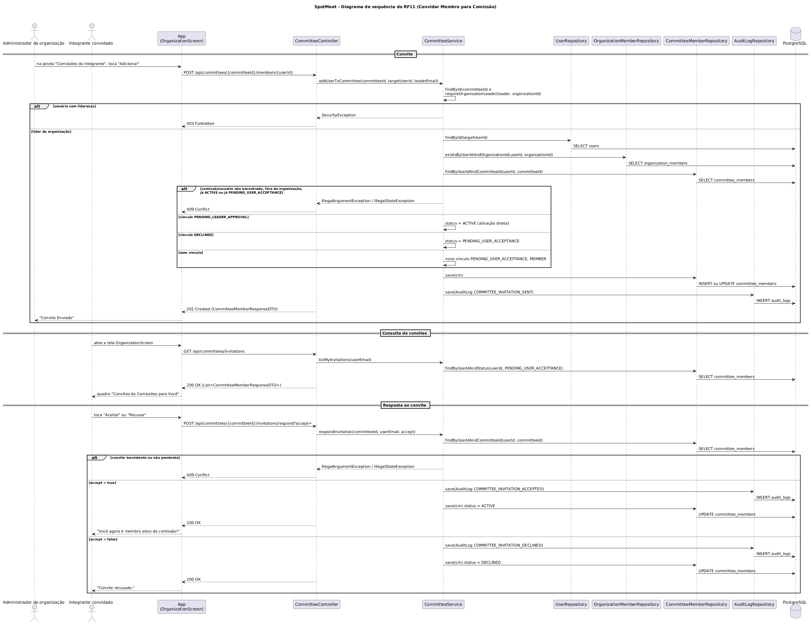

Fonte: próprio autor

#### RF12 – Solicitar Entrada em Comissão

| Campo | Descrição |
|---|---|
| Função | **Solicitação:** Registra o pedido de um integrante da organização para ingressar em uma comissão.  **Consulta de solicitações:** Lista as solicitações de entrada pendentes de aprovação.  **Resposta à solicitação:** Registra a aprovação ou a rejeição da solicitação pelo administrador da organização. |
| Descrição | **Solicitação:** Insere na tabela committee_members um vínculo do integrante com a comissão, com situação PENDING_LEADER_APPROVAL e papel MEMBER. Quando já existe vínculo com situação PENDING_USER_ACCEPTANCE (o integrante havia sido convidado), o vínculo é alterado diretamente para ACTIVE. Quando já existe vínculo com situação DECLINED, o vínculo é reaberto com situação PENDING_LEADER_APPROVAL.  **Consulta de solicitações:** Consulta na tabela committee_members os vínculos com situação PENDING_LEADER_APPROVAL de todas as comissões da organização ou de uma comissão específica.  **Resposta à solicitação:** Atualiza na tabela committee_members a situação do vínculo para ACTIVE, em caso de aprovação, ou para DECLINED, em caso de rejeição, registrando a data da resposta (responded_at). |
| Entradas | **Solicitação:** Identificador da comissão (committeeId, do tipo Long), informado na rota.  **Consulta de solicitações:** Identificador da organização (organizationId, do tipo Long) ou identificador da comissão (committeeId, do tipo Long), informado na rota.  **Resposta à solicitação:** Identificador do vínculo (membershipId, do tipo Long), informado na rota, e parâmetro approve, do tipo boolean (true para aprovar, false para rejeitar). |
| Origem | **Solicitação:** Usuário (integrante da organização).  **Consulta de solicitações:** Usuário (administrador da organização).  **Resposta à solicitação:** Usuário (administrador da organização). |
| Saída | **Solicitação:** Objeto do tipo CommitteeMemberResponseDTO (id, userId, userName, userEmail, committeeId, committeeName, organizationId, status, role, requestedAt, respondedAt e invitedByName), com código HTTP 201 (Created); ou mensagem de erro.  **Consulta de solicitações:** Lista de objetos do tipo CommitteeMemberResponseDTO, com código HTTP 200; ou mensagem de erro.  **Resposta à solicitação:** Objeto do tipo CommitteeMemberResponseDTO com a nova situação, com código HTTP 200; ou mensagem de erro. |
| Destino | Aplicativo (tela OrganizationScreen). |
| Ação | **Solicitação:** Na aba "Gerenciar" da tela OrganizationScreen, o integrante sem papel de liderança (papel MEMBER) seleciona o botão "Solicitar" de uma comissão na seção "Comissões", ou o botão "Solicitar" de uma comissão com a indicação "Não vinculado" na janela "Comissões do Integrante" aberta sobre o próprio usuário. O aplicativo envia uma requisição POST para /api/committees/{committeeId}/join-requests, tratada pelo método requestToJoin da classe CommitteeController, que chama o método requestToJoin(committeeId, userEmail) da classe CommitteeService. O serviço localiza a comissão pelo método findById da classe CommitteeRepository, verifica pelo método existsByUserIdAndOrganizationId da classe OrganizationMemberRepository se o usuário pertence à organização, consulta o vínculo existente pelo método findByUserIdAndCommitteeId da classe CommitteeMemberRepository e cria ou altera o vínculo conforme descrito, gravando-o pelo método save.  **Consulta de solicitações:** Ao acessar a aba "Gerenciar" com o papel de dono, vice-líder ou subdono, o aplicativo envia uma requisição GET para /api/organizations/{organizationId}/committees/join-requests, tratada pelo método listPendingJoinRequestsForOrganization da classe CommitteeController, que chama o método listPendingJoinRequestsForOrganization(organizationId, executorEmail) da classe CommitteeService. O serviço verifica pelo método requireOrganizationLeader se o usuário é líder e consulta o método findByCommitteeOrganizationIdAndStatus da classe CommitteeMemberRepository. A seção "Solicitações de Entrada em Comissões" exibe o nome e o e-mail do solicitante, o nome da comissão e os botões de aprovação (ícone de confirmação) e de rejeição (ícone de fechar). O sistema oferece também a rota GET /api/committees/{committeeId}/join-requests, tratada pelo método listPendingJoinRequests da classe CommitteeController, que chama o método listPendingJoinRequests(committeeId, leaderEmail) da classe CommitteeService e consulta o método findByCommitteeIdAndStatus, restrita às solicitações de uma única comissão; essa rota não é utilizada pelo aplicativo.  **Resposta à solicitação:** Ao clicar no botão de aprovação ou de rejeição, o aplicativo envia uma requisição POST para /api/committees/join-requests/{membershipId}/respond?approve=true ou approve=false, tratada pelo método respondJoinRequest da classe CommitteeController, que chama o método respondJoinRequest(membershipId, leaderEmail, approve) da classe CommitteeService. O serviço localiza o vínculo pelo método findById da classe CommitteeMemberRepository, verifica pelo método requireOrganizationLeader se o usuário é líder da organização da comissão, verifica se a situação é PENDING_LEADER_APPROVAL, altera a situação e grava o vínculo pelo método save. |
| Pré-condição | **Solicitação:** O usuário deve estar autenticado e ser integrante da organização da comissão.  **Consulta de solicitações:** O usuário deve estar autenticado e ser dono, vice-líder ou subdono da organização, ou administrador do sistema (papel SYSADMIN).  **Resposta à solicitação:** O usuário deve estar autenticado e ser dono, vice-líder ou subdono da organização da comissão, ou administrador do sistema (papel SYSADMIN); a solicitação deve estar com situação PENDING_LEADER_APPROVAL. |
| Pós-condição | **Solicitação:** O sistema deve exibir a mensagem "Solicitação Enviada!" informando que o pedido foi enviado para aprovação dos líderes, ou a mensagem de erro retornada pelo servidor com código 409, quando a comissão não for encontrada, o usuário não pertencer à organização, já for integrante ativo da comissão ou já possuir solicitação pendente.  **Consulta de solicitações:** O sistema deve exibir a lista de solicitações pendentes ou o texto "Nenhuma solicitação de comissão pendente de aprovação.".  **Resposta à solicitação:** O sistema deve exibir a mensagem "Membro aprovado na comissão!" ou "Solicitação para comissão rejeitada.", ou a mensagem de erro retornada pelo servidor: código 403 para usuário sem permissão e 409 para solicitação não encontrada ou que não esteja pendente. |
| Efeitos colaterais | **Solicitação:** Registro na tabela audit_logs com a ação COMMITTEE_JOIN_REQUESTED, contendo o nome da comissão e o nome da organização, somente quando um novo vínculo é criado. A ativação direta de convite pendente e a reabertura de vínculo recusado não geram registro de auditoria.  **Consulta de solicitações:** Nenhum.  **Resposta à solicitação:** Registro na tabela audit_logs com a ação COMMITTEE_JOIN_APPROVED, em caso de aprovação, ou COMMITTEE_JOIN_REJECTED, em caso de rejeição, contendo o e-mail do solicitante e o nome da comissão. |

**Figura 18 – Diagrama de sequência do RF12**

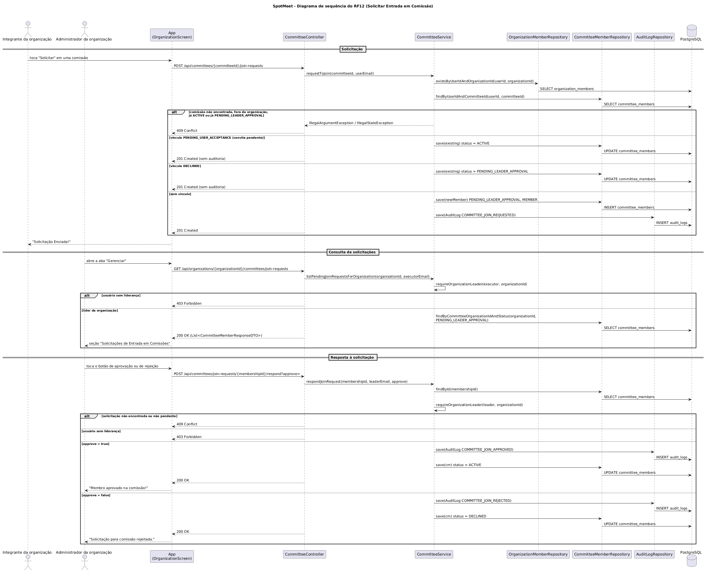

Fonte: próprio autor

#### RF13 – Manter Integrantes da Comissão

| Campo | Descrição |
|---|---|
| Função | **Pesquisa:** Consulta a situação de um integrante em cada comissão da organização.  **Exclusão:** Remove o vínculo de um integrante com uma comissão. |
| Descrição | **Pesquisa:** Consulta na tabela committees todas as comissões da organização, em ordem alfabética de nome, e na tabela committee_members o vínculo do integrante com cada uma delas, indicando se há vínculo, a situação, o papel e o identificador do vínculo.  **Exclusão:** Remove da tabela committee_members o vínculo do integrante com a comissão, qualquer que seja a sua situação (ativo, convite pendente, solicitação pendente ou recusado). |
| Entradas | **Pesquisa:** Identificador da organização (organizationId, do tipo Long) e identificador do integrante (userId, do tipo Long), informados na rota.  **Exclusão:** Identificador da comissão (committeeId, do tipo Long) e identificador do integrante (userId, do tipo Long), informados na rota. |
| Origem | **Pesquisa:** Usuário (integrante da organização).  **Exclusão:** Usuário (administrador da organização). |
| Saída | **Pesquisa:** Lista de objetos do tipo UserCommitteeLinkDTO (committeeId, committeeName, description, linked, membershipStatus, role e membershipId), com código HTTP 200; ou mensagem de erro.  **Exclusão:** Texto "Acesso a comissao revogado com sucesso.", com código HTTP 200; ou mensagem de erro. |
| Destino | Aplicativo (tela OrganizationScreen). |
| Ação | **Pesquisa:** Na seção "Integrantes Ativos" da aba "Gerenciar" da tela OrganizationScreen, o usuário seleciona o botão de comissões (ícone de camadas) de um integrante. O sistema abre a janela "Comissões do Integrante" e o aplicativo envia uma requisição GET para /api/organizations/{organizationId}/members/{userId}/committees, tratada pelo método listUserCommitteeLinks da classe CommitteeController, que chama o método listUserCommitteeLinks(organizationId, targetUserId, executorEmail) da classe CommitteeService. O serviço verifica pelo método existsByUserIdAndOrganizationId da classe OrganizationMemberRepository se o usuário e o integrante consultado pertencem à organização, obtém as comissões pelo método findByOrganizationIdOrderByNameAsc da classe CommitteeRepository e, para cada uma, consulta o vínculo pelo método findByUserIdAndCommitteeId da classe CommitteeMemberRepository. A janela exibe, para cada comissão, a indicação "Membro Ativo", "Aguardando aceite do usuário", "Solicitou entrada" ou "Não vinculado". Quando o usuário tem papel MEMBER e consulta outro integrante, o aplicativo exibe apenas as comissões em que esse integrante está ativo ou, não havendo nenhuma, o texto "Este integrante ainda não está vinculado a nenhuma comissão ativa.".  **Exclusão:** Na janela "Comissões do Integrante", o dono, o vice-líder ou o subdono seleciona o botão "Remover", exibido para vínculos ativos, ou "Cancelar", exibido para convites aguardando aceite. O aplicativo envia uma requisição DELETE para /api/committees/{committeeId}/members/{userId}, tratada pelo método removeUserFromCommittee da classe CommitteeController, que chama o método removeUserFromCommittee(committeeId, targetUserId, leaderEmail) da classe CommitteeService. O serviço localiza a comissão pelo método findById da classe CommitteeRepository, verifica pelo método requireOrganizationLeader se o usuário é líder da organização, localiza o vínculo pelo método findByUserIdAndCommitteeId e o remove pelo método delete da classe CommitteeMemberRepository. |
| Pré-condição | **Pesquisa:** O usuário deve estar autenticado e ser integrante da organização, ou administrador do sistema (papel SYSADMIN); o integrante consultado deve pertencer à organização.  **Exclusão:** O usuário deve estar autenticado e ser dono, vice-líder ou subdono da organização da comissão, ou administrador do sistema (papel SYSADMIN); deve existir vínculo do integrante com a comissão. |
| Pós-condição | **Pesquisa:** O sistema deve exibir a situação do integrante em cada comissão ou o texto "Nenhuma comissão cadastrada nesta organização.". Em caso de erro (código 403 para usuário que não pertence à organização e 409 para integrante não encontrado ou que não pertence à organização), o aplicativo descarta a resposta e a janela exibe o mesmo texto "Nenhuma comissão cadastrada nesta organização.".  **Exclusão:** O sistema deve exibir a mensagem "Vínculo do integrante com a comissão foi revogado." ou a mensagem de erro retornada pelo servidor: código 403 para usuário sem permissão e 409 para comissão ou vínculo não encontrado. |
| Efeitos colaterais | **Pesquisa:** Nenhum.  **Exclusão:** Registro na tabela audit_logs com a ação COMMITTEE_MEMBER_REMOVED, contendo o identificador do integrante e o nome da comissão. |

**Figura 19 – Diagrama de sequência do RF13**

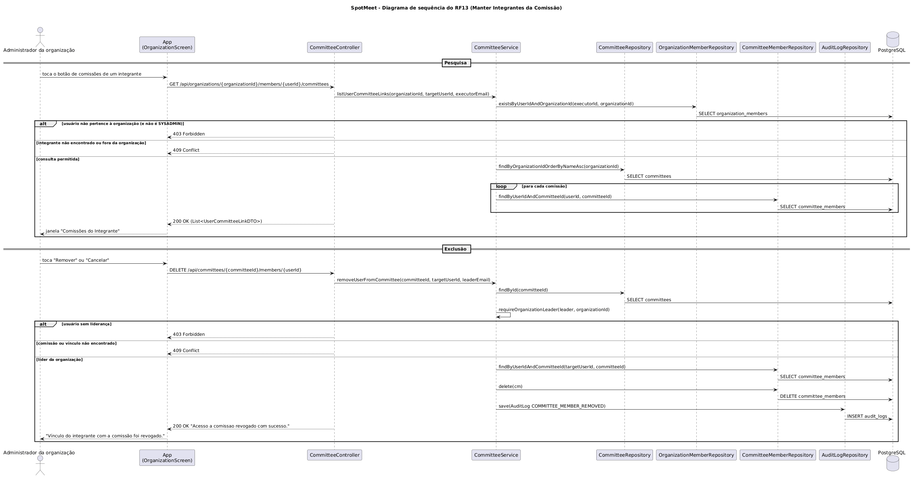

Fonte: próprio autor

#### RF14 – Alterar Senha

| Campo | Descrição |
|---|---|
| Função | Altera a senha do usuário autenticado. |
| Descrição | Atualiza, na tabela users do banco de dados, a coluna password do usuário autenticado com o hash BCrypt da nova senha, após a conferência da senha atual informada pelo próprio usuário. |
| Entradas | Objeto do tipo ChangePasswordDTO contendo a string currentPassword (obrigatória) e a string newPassword (obrigatória, com no mínimo 6 caracteres, contendo pelo menos uma letra maiúscula, uma letra minúscula e um número, conforme a expressão regular ^(?=.*[a-z])(?=.*[A-Z])(?=.*\d).{6,}$). O e-mail do usuário não é enviado no corpo da requisição: é obtido do token JWT informado no cabeçalho Authorization. O campo Confirmar Nova Senha é usado apenas na validação feita pelo aplicativo e não é enviado ao servidor. |
| Origem | Usuário. |
| Saída | Objeto JSON com os campos success (booleano) e message (string). Em caso de sucesso, HTTP 200 com a mensagem "Senha alterada com sucesso!". Em caso de regra de negócio violada ou de falha de validação do ChangePasswordDTO, HTTP 400 com a mensagem correspondente. Em caso de erro inesperado, HTTP 500 com a mensagem "Erro ao alterar senha: " seguida da causa. |
| Destino | Usuário (mensagem exibida no aplicativo). |
| Ação | O usuário acessa a aba Ajustes, que exibe a tela SettingsScreen (título "Perfil & Ajustes"), e localiza o cartão Segurança. O sistema exibe os campos Senha Atual, Nova Senha e Confirmar Nova Senha, cada um com um botão para mostrar ou ocultar o conteúdo. Ao clicar no botão Alterar Senha, o aplicativo verifica se a senha atual foi informada, se a nova senha atende às regras de segurança (função checkPasswordRules), se a confirmação é igual à nova senha e se a nova senha é diferente da atual. Em caso positivo, o aplicativo envia a requisição PUT /api/users/me/password, tratada pelo método changeMyPassword da classe UserController, que chama o método changePassword(authenticatedEmail, dto) da classe UserService. O serviço localiza o usuário pelo método findByEmail da interface UserRepository, confere a senha atual com o método matches do PasswordEncoder, recusa a nova senha caso ela coincida com a senha já gravada, gera o hash da nova senha com o método encode e grava o usuário pelo método save. |
| Pré-condição | O usuário deve estar autenticado no aplicativo, com um token JWT válido. A aba Ajustes é exibida apenas na barra de abas dos usuários com o papel USER. |
| Pós-condição | O sistema deve avisar ao usuário se a alteração ocorreu com sucesso, limpando os três campos do cartão Segurança, ou exibir a mensagem de erro retornada, como "A senha atual está incorreta." ou "A nova senha deve ser diferente da senha atual.". |
| Efeitos colaterais | Registro na tabela audit_logs com a ação PASSWORD_CHANGED. O token JWT em uso não é substituído. |

**Figura 20 – Diagrama de sequência do RF14**

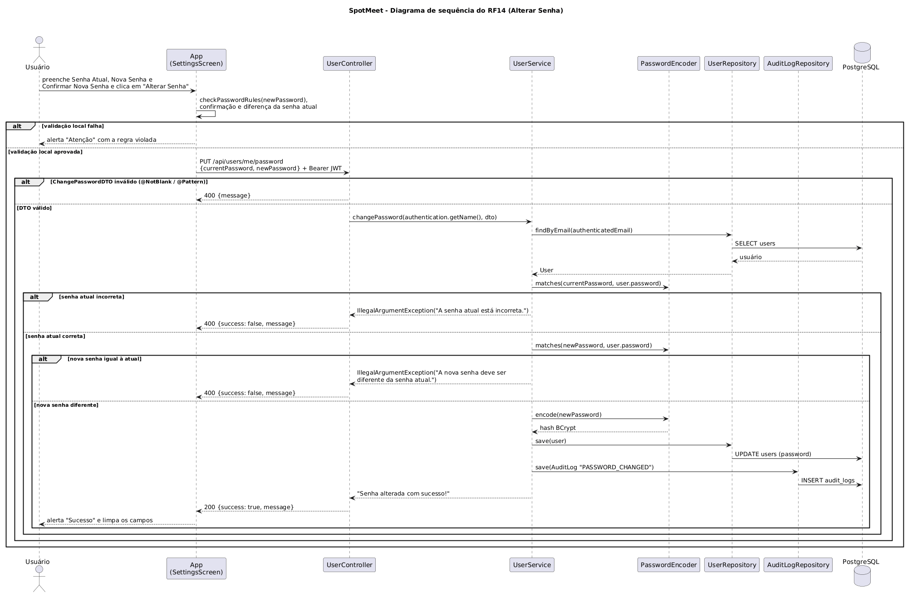

Fonte: próprio autor

#### RF15 – Recuperar Conta

| Campo | Descrição |
|---|---|
| Função | Permite ao usuário que esqueceu a senha definir uma nova senha por meio de um código de recuperação enviado ao e-mail cadastrado. |
| Descrição | Grava, nas colunas recovery_token e recovery_token_expires_at da tabela users, um código numérico de 6 dígitos gerado com SecureRandom e válido por 5 minutos (constante CODE_EXPIRATION_MINUTES da classe UserService). Em seguida, valida esse código e, na última etapa, grava na coluna password o hash BCrypt da nova senha, limpando o código e sua data de expiração. |
| Entradas | **Etapa 1 (Solicitação do código):** objeto do tipo ForgotPasswordDTO contendo a string email (obrigatória, em formato de e-mail).   **Etapa 2 (Validação do código):** objeto do tipo VerifyRecoveryCodeDTO contendo a string email (obrigatória) e a string token (obrigatória), que corresponde ao código de 6 dígitos recebido.   **Etapa 3 (Nova senha):** objeto do tipo ResetPasswordDTO contendo a string email (obrigatória), a string token (obrigatória) e a string newPassword (obrigatória, com no mínimo 6 caracteres, contendo pelo menos uma letra maiúscula, uma letra minúscula e um número). O campo Confirmar Nova Senha é usado apenas na validação feita pelo aplicativo. Nenhum dos três DTOs define tamanho máximo para os campos. |
| Origem | Usuário. |
| Saída | **Etapa 1:** objeto JSON com os campos success, message, channel (valor "EMAIL") e delivered, sempre com HTTP 200 quando o DTO é válido, inclusive para e-mail não cadastrado. Quando o e-mail não é entregue por SMTP, a resposta traz também os campos devCode e warning.   **Etapa 2:** objeto JSON com os campos success e message; HTTP 200 com a mensagem "Código validado. Defina a nova senha." ou HTTP 400 com a mensagem de erro.   **Etapa 3:** objeto JSON com os campos success e message; HTTP 200 com a mensagem "Senha redefinida com sucesso! Você já pode acessar sua conta com a nova senha." ou HTTP 400 com a mensagem de erro.   Falhas de validação dos DTOs retornam HTTP 400. |
| Destino | Usuário (mensagens exibidas no aplicativo) e caixa de e-mail cadastrada (código de recuperação). |
| Ação | **Etapa 1:** Na tela AuthScreen, no modo de login, o usuário clica no link Esqueci minha senha. O sistema exibe a tela "Recuperação de Conta" (Etapa 1 de 3), com o campo E-mail Cadastrado. Ao clicar no botão Enviar Código por E-mail, o aplicativo verifica se o e-mail foi digitado e envia a requisição POST /api/auth/forgot-password, tratada pelo método forgotPassword da classe AuthController, que chama o método forgotPassword(dto) da classe UserService. O serviço localiza o usuário pelo método findByEmail da interface UserRepository, usando o e-mail em letras minúsculas; se a conta existir, gera o código, grava o código e a data de expiração pelo método save e chama o método sendPasswordRecoveryEmail da classe EmailService. O aplicativo exibe o alerta "Instruções Enviadas", bloqueia o reenvio por 60 segundos e passa para a etapa seguinte.   **Etapa 2:** O sistema exibe a tela "Código de Verificação" (Etapa 2 de 3), com o campo Código de Verificação. Ao clicar no botão Validar Código, o aplicativo verifica se o código foi digitado e envia a requisição POST /api/auth/verify-recovery-code, tratada pelo método verifyRecoveryCode da classe AuthController, que chama o método verifyRecoveryCode(dto) da classe UserService. Esse método usa o método privado resolveRecoveryToken(email, token), que confere se o código corresponde ao gravado e se não expirou, sem consumi-lo. Enquanto o bloqueio de 60 segundos estiver ativo, o link de reenvio fica desabilitado e exibe a contagem regressiva no formato "Reenviar e-mail em 60s"; depois, exibe "Não recebeu? Reenviar e-mail" e repete a Etapa 1. O link "E-mail errado? Alterar e-mail" retorna à Etapa 1.   **Etapa 3:** O sistema exibe a tela "Criar Nova Senha" (Etapa 3 de 3), com os campos Nova Senha e Confirmar Nova Senha e a lista "Requisitos da Nova Senha:". Ao clicar no botão Atualizar Senha, o aplicativo verifica a nova senha com a expressão regular PASSWORD_REGEX e a igualdade com a confirmação, e envia a requisição POST /api/auth/reset-password, tratada pelo método resetPassword da classe AuthController, que chama o método resetPassword(dto) da classe UserService. O serviço valida o código com resolveRecoveryToken, gera o hash da nova senha com o método encode do PasswordEncoder, limpa as colunas recovery_token e recovery_token_expires_at, marca email_verified como verdadeiro e grava o usuário pelo método save. |
| Pré-condição | O sistema deve estar em execução. O usuário não precisa estar autenticado, pois as rotas /api/auth/** são públicas. Para as Etapas 2 e 3, o código de recuperação deve ter sido gerado para uma conta cadastrada e estar dentro do prazo de 5 minutos. |
| Pós-condição | **Etapa 1:** o sistema deve exibir a mensagem retornada e a tela de digitação do código.   **Etapa 2:** o sistema deve exibir a tela de nova senha, ou avisar que o código é incorreto ou expirou.   **Etapa 3:** o sistema deve avisar ao usuário se a senha foi redefinida com sucesso e retornar à tela de login, ou exibir a mensagem de erro. |
| Efeitos colaterais | **Etapa 1:** envio de e-mail com o assunto "SpotMeet - Recuperação de Senha", contendo o código; registro na tabela audit_logs com a ação PASSWORD_RECOVERY_REQUESTED. Ambos ocorrem somente quando o e-mail pertence a uma conta cadastrada.   **Etapa 2:** Nenhum.   **Etapa 3:** registro na tabela audit_logs com a ação PASSWORD_RESET; a coluna email_verified do usuário passa a ter o valor verdadeiro. |

**Figura 21 – Diagrama de sequência do RF15**

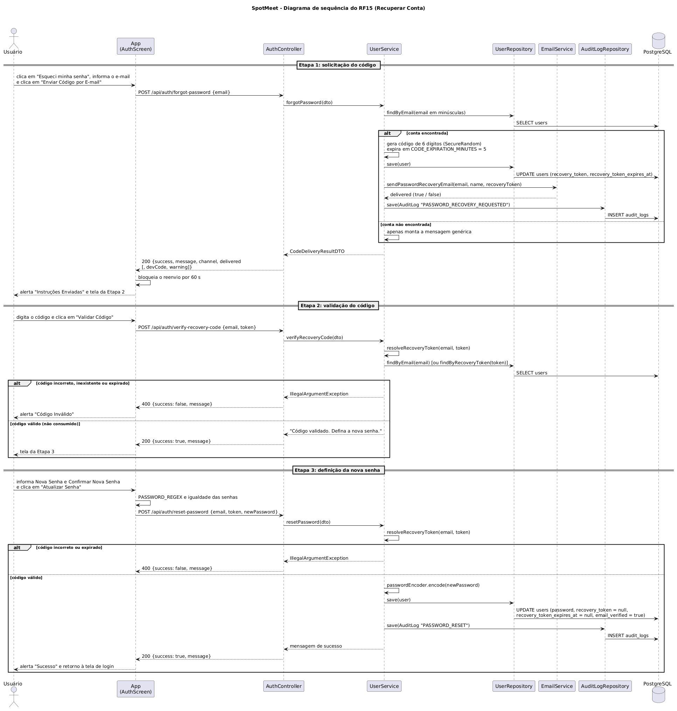

Fonte: próprio autor

#### RF16 – Alterar Dados Pessoais

| Campo | Descrição |
|---|---|
| Função | Consulta e altera os dados pessoais do usuário autenticado: nome, biografia e status de presença. |
| Descrição | Lê da tabela users do banco de dados o perfil do usuário autenticado e atualiza as colunas name, bio e availability_status com as informações fornecidas pelo usuário. O e-mail é exibido apenas para leitura e sua alteração é tratada no RF18; o tema preferido, enviado na mesma requisição, é tratado no RF17. |
| Entradas | **Consulta:** nenhuma entrada além do token JWT informado no cabeçalho Authorization, do qual é obtido o e-mail do usuário.   **Atualização:** objeto do tipo UpdateUserProfileDTO contendo a string name (opcional, entre 2 e 100 caracteres), a string bio (opcional, com no máximo 500 caracteres, gravada na coluna bio de tamanho 500) e a string availabilityStatus (opcional, com os valores aceitos PRESENT, ONLINE, BUSY ou AWAY, conforme o enum AvailabilityStatus da classe User). O mesmo DTO contém a string preferredTheme, descrita no RF17. |
| Origem | Usuário. |
| Saída | **Consulta:** objeto do tipo UserProfileResponseDTO com os campos id, name, email, bio, availabilityStatus, preferredTheme e role, com HTTP 200, ou HTTP 404 caso o usuário não seja encontrado.   **Atualização:** objeto do tipo UserProfileResponseDTO com os dados gravados, com HTTP 200; HTTP 400 em caso de falha de validação ou de usuário não encontrado; HTTP 500 em caso de erro inesperado, com a mensagem "Erro ao atualizar perfil: " seguida da causa. |
| Destino | Usuário (dados exibidos na tela SettingsScreen). |
| Ação | **Consulta:** O usuário acessa a aba Ajustes, que exibe a tela SettingsScreen (título "Perfil & Ajustes"). Ao receber o foco, a tela exibe "Carregando perfil..." e envia a requisição GET /api/users/me, tratada pelo método getMyProfile da classe UserController, que chama o método getMyProfile(email) da classe UserService. O serviço localiza o usuário pelo método findByEmail da interface UserRepository e retorna o resultado de UserProfileResponseDTO.fromEntity. A tela preenche os campos Nome Completo, E-mail (somente leitura) e Biografia Pessoal e marca a opção de status correspondente. Enquanto a tela está em foco, a consulta é repetida a cada 8 segundos pelo hook useLiveSync e também ao receber o evento PROFILE_MUTATED.   **Atualização:** O usuário altera o campo Nome Completo, o campo Biografia Pessoal (limitado a 500 caracteres, com contador no formato "0 / 500") e escolhe, no cartão Status de Presença, uma das opções Presente (Disponível), Ausente ou Ocupado. Ao clicar no botão Salvar Alterações, o aplicativo verifica se o nome foi digitado e se possui pelo menos 2 caracteres. Em caso positivo, envia a requisição PUT /api/users/me com os campos name, bio, availabilityStatus e preferredTheme, tratada pelo método updateMyProfile da classe UserController, que chama o método updateMyProfile(email, dto) da classe UserService. O serviço localiza o usuário pelo método findByEmail, grava o nome sem espaços nas extremidades somente se ele não estiver em branco, grava a biografia sempre que ela for enviada, converte o status para letras maiúsculas e o aplica somente se corresponder a um valor do enum AvailabilityStatus (valores desconhecidos são ignorados) e grava o usuário pelo método save. |
| Pré-condição | O usuário deve estar autenticado no aplicativo, com um token JWT válido. A aba Ajustes é exibida apenas na barra de abas dos usuários com o papel USER. |
| Pós-condição | **Consulta:** o sistema deve exibir os dados atuais do perfil.   **Atualização:** o sistema deve avisar ao usuário se a gravação ocorreu com sucesso, com a mensagem "Perfil e preferências salvos com sucesso!", atualizando o nome na sessão do aplicativo, ou exibir a mensagem de erro. |
| Efeitos colaterais | **Consulta:** Nenhum.   **Atualização:** registro na tabela audit_logs com a ação PROFILE_UPDATED; o aplicativo emite o evento PROFILE_MUTATED para as demais telas que o observam. |

**Figura 22 – Diagrama de sequência do RF16**

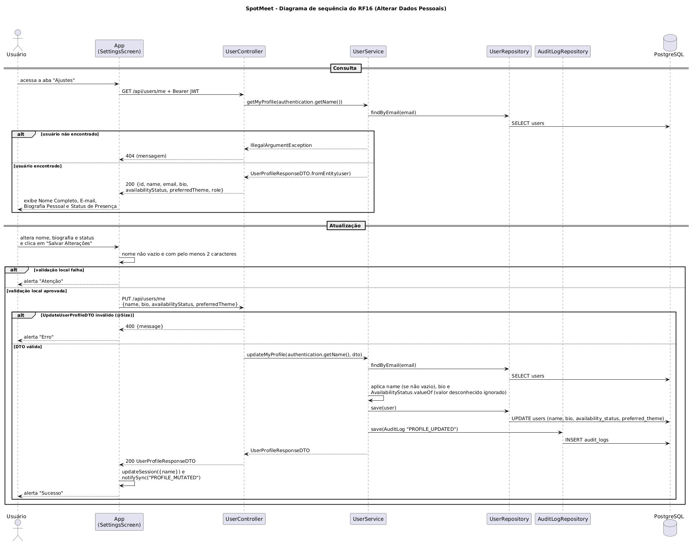

Fonte: próprio autor

#### RF17 – Definir Tema

| Campo | Descrição |
|---|---|
| Função | Define o tema visual preferido do aplicativo para o usuário autenticado. |
| Descrição | Aplica no aplicativo o tema escolhido pelo usuário e grava a preferência na coluna preferred_theme da tabela users, para que seja restaurada nos próximos acessos. |
| Entradas | Objeto do tipo UpdateUserProfileDTO contendo a string preferredTheme. O backend aceita os valores LIGHT, DARK e SYSTEM (enum PreferredTheme da classe User); o aplicativo oferece e envia apenas LIGHT e DARK. Na mesma requisição seguem os campos name, bio e availabilityStatus, descritos no RF16. |
| Origem | Usuário. |
| Saída | Objeto do tipo UserProfileResponseDTO com os dados gravados, incluindo o campo preferredTheme, com HTTP 200; HTTP 400 em caso de falha de validação ou de usuário não encontrado; HTTP 500 em caso de erro inesperado. |
| Destino | Usuário (cores da interface do aplicativo). |
| Ação | **Carregamento:** Ao autenticar-se, o componente ThemeProvider (arquivo ThemeContext) chama a função loadThemeFromProfile, que envia a requisição GET /api/users/me e aplica o tema recebido se ele for LIGHT ou DARK. Sem autenticação, o tema padrão é DARK.   **Seleção:** Na tela SettingsScreen, aba Ajustes, o cartão Tema da Aplicação exibe as opções Modo Escuro e Modo Claro, com a orientação "Selecione para testar em tempo real. Apenas será salvo definitivamente ao clicar em "Salvar Alterações":". Ao tocar em uma opção, o aplicativo chama setTheme(theme, false), que troca as cores imediatamente sem enviar nada ao servidor.   **Gravação:** Ao clicar no botão Salvar Alterações, o aplicativo envia a requisição PUT /api/users/me com o campo preferredTheme igual ao tema selecionado, tratada pelo método updateMyProfile da classe UserController, que chama o método updateMyProfile(email, dto) da classe UserService. O serviço converte o valor para letras maiúsculas e o aplica somente se corresponder a um valor do enum PreferredTheme (valores desconhecidos são ignorados), gravando o usuário pelo método save da interface UserRepository. O aplicativo guarda o tema retornado como preferência salva. Se o usuário sair da aba Ajustes sem salvar, o aplicativo restaura o último tema gravado. |
| Pré-condição | O usuário deve estar autenticado no aplicativo, com um token JWT válido. A aba Ajustes é exibida apenas na barra de abas dos usuários com o papel USER. |
| Pós-condição | O sistema deve exibir a interface com o tema escolhido e avisar ao usuário, com a mensagem "Perfil e preferências salvos com sucesso!", que a preferência foi gravada, ou exibir a mensagem de erro. |
| Efeitos colaterais | Registro na tabela audit_logs com a ação PROFILE_UPDATED, cujo detalhe informa o tema gravado; o aplicativo emite o evento PROFILE_MUTATED. |

**Figura 23 – Diagrama de sequência do RF17**

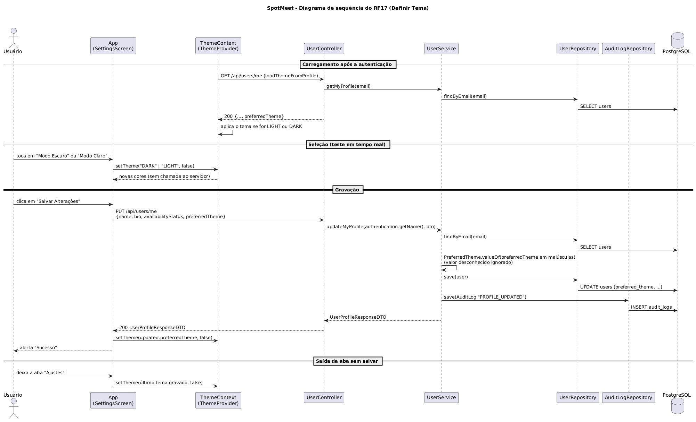

Fonte: próprio autor

#### RF18 – Alterar E-mail

| Campo | Descrição |
|---|---|
| Função | Altera o e-mail do usuário autenticado mediante dupla confirmação: um código enviado ao e-mail atual e outro enviado ao novo e-mail. |
| Descrição | Grava na tabela users os códigos temporários de 6 dígitos das colunas current_email_change_token e new_email_token, com suas datas de expiração, e o endereço pendente na coluna pending_new_email. Cada código é válido por 5 minutos (constante CODE_EXPIRATION_MINUTES da classe UserService). Ao final, substitui o valor da coluna email pelo novo endereço, limpa as colunas temporárias e emite um novo token JWT. |
| Entradas | **Etapa 1 (Solicitação):** nenhuma entrada além do token JWT informado no cabeçalho Authorization, do qual é obtido o e-mail atual.   **Etapa 2 (Confirmação do e-mail atual):** objeto do tipo ConfirmEmailChangeDTO contendo a string currentCode (obrigatória, com exatamente 6 dígitos numéricos, conforme a expressão regular ^\d{6}$) e a string newEmail (obrigatória, em formato de e-mail).   **Etapa 3 (Conclusão):** objeto do tipo CompleteEmailChangeDTO contendo a string newEmailCode (obrigatória, com exatamente 6 dígitos numéricos). |
| Origem | Usuário. |
| Saída | **Etapa 1:** objeto JSON com os campos success, message e currentEmail, com HTTP 200; quando o e-mail não é entregue por SMTP, a resposta traz também os campos devCode e warning.   **Etapa 2:** objeto JSON com os campos success, message e newEmail, com HTTP 200, acrescido de devCode e warning quando o e-mail não é entregue; HTTP 400 com success igual a falso e a mensagem de erro.   **Etapa 3:** objeto JSON com os campos success, message ("E-mail alterado com sucesso!"), newEmail e token (novo token JWT), com HTTP 200; HTTP 400 com a mensagem de erro.   Em todas as etapas, erro inesperado retorna HTTP 500. |
| Destino | Usuário (mensagens exibidas no aplicativo), caixa do e-mail atual (código de autorização) e caixa do novo e-mail (código de ativação). |
| Ação | **Etapa 1:** Na tela SettingsScreen, aba Ajustes, o campo E-mail é exibido apenas para leitura. O usuário clica no botão Solicitar Alteração Segura de E-mail e o sistema abre a janela modal Alterar E-mail (subtítulo "Segurança e Conformidade LGPD"), que envia a requisição POST /api/users/me/email-change/request, tratada pelo método requestEmailChange da classe UserController, que chama o método requestEmailChange(authenticatedEmail) da classe UserService. O serviço localiza o usuário pelo método findByEmail da interface UserRepository, gera o código de autorização, grava-o pelo método save e chama o método sendCurrentEmailChangeCode da classe EmailService. O botão de reenvio fica bloqueado por 60 segundos, exibindo "Reenviar código em 60s" em contagem regressiva, e depois exibe "Reenviar código para e-mail atual", que repete esta etapa.   **Etapa 2:** O usuário digita o código no campo Código de Confirmação (6 dígitos) e o endereço no campo Novo E-mail Desejado. Ao clicar no botão Avançar para Etapa 2, o aplicativo verifica se o código tem 6 caracteres, se o e-mail tem formato válido e se é diferente do atual, e envia a requisição POST /api/users/me/email-change/confirm, tratada pelo método confirmEmailChange da classe UserController, que chama o método confirmEmailChange(authenticatedEmail, dto) da classe UserService. O serviço recusa um novo e-mail idêntico ao atual, confere o código de autorização e sua validade, verifica pelo método existsByEmail se o novo endereço já pertence a outra conta, grava o endereço pendente e o código de ativação pelo método save e chama o método sendNewEmailConfirmationCode da classe EmailService. O aplicativo exibe o alerta "Etapa 1 Concluída" e o passo Novo E-mail da janela modal.   **Etapa 3:** O usuário digita o código no campo Código Recebido no Novo E-mail e clica no botão Confirmar e Atualizar. O aplicativo verifica se o código tem 6 caracteres e envia a requisição POST /api/users/me/email-change/complete, tratada pelo método completeEmailChange da classe UserController, que chama o método completeEmailChange(authenticatedEmail, dto) da classe UserService. O serviço verifica se há troca pendente, confere o código de ativação e sua validade, verifica novamente com existsByEmail se o endereço continua livre, grava o novo e-mail, marca email_verified como verdadeiro, limpa as colunas temporárias e salva o usuário. O controlador gera um novo token JWT pelo método generateToken(email, role) da classe JwtUtil. Nesse passo, o botão Voltar retorna ao passo anterior e o botão "Reenviar código para novo e-mail" reenvia a requisição da Etapa 2. |
| Pré-condição | O usuário deve estar autenticado no aplicativo, com um token JWT válido. A aba Ajustes é exibida apenas na barra de abas dos usuários com o papel USER. |
| Pós-condição | O sistema deve avisar ao usuário, a cada etapa, se a operação ocorreu com sucesso ou se houve erro. Ao final, deve exibir a mensagem "E-mail atualizado com sucesso em conformidade com as regras de segurança e LGPD.", fechar a janela modal e passar a usar o novo e-mail e o novo token JWT na sessão do aplicativo. |
| Efeitos colaterais | **Etapa 1:** envio de e-mail ao endereço atual com o assunto "SpotMeet - Autorização de Alteração de E-mail (LGPD)"; registro na tabela audit_logs com a ação LGPD_EMAIL_CHANGE_REQUESTED.   **Etapa 2:** envio de e-mail ao novo endereço com o assunto "SpotMeet - Validação do Novo Endereço de E-mail"; registro na tabela audit_logs com a ação LGPD_EMAIL_CHANGE_STEP1_CONFIRMED.   **Etapa 3:** registro na tabela audit_logs com a ação LGPD_EMAIL_CHANGED, contendo o e-mail anterior e o novo; emissão de um novo token JWT, que substitui o anterior na sessão do aplicativo. |

**Figura 24 – Diagrama de sequência do RF18**

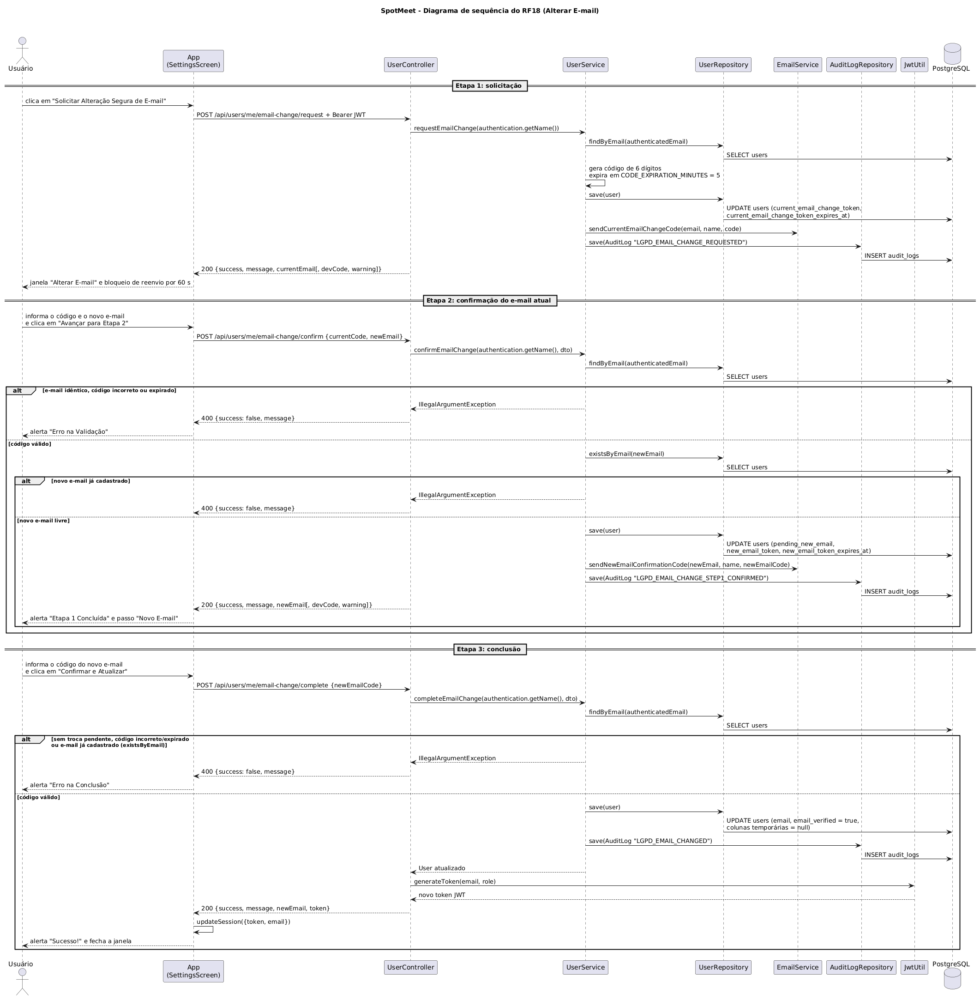

Fonte: próprio autor

#### RF19 – Inicializar Sistema

| Campo | Descrição |
|---|---|
| Função | Inicia o servidor e o aplicativo do SpotMeet e realiza o setup inicial do Administrador do Sistema. |
| Descrição | Realiza a inicialização do backend Spring Boot, que cria ou atualiza as tabelas do banco de dados PostgreSQL e garante a existência da conta do Administrador do Sistema na tabela users. Realiza também a inicialização do aplicativo móvel, que resolve o endereço do servidor e exibe a tela de autenticação. |
| Entradas | Nenhuma entrada do usuário. O backend lê as propriedades do arquivo application.properties e do arquivo .env (server.port, cujo padrão é 8080, spring.datasource.url, spring.datasource.username, spring.datasource.password e spring.jpa.hibernate.ddl-auto=update). O aplicativo lê o host salvo no armazenamento local do dispositivo sob a chave @spotmeet/api-host, as variáveis de ambiente EXPO_PUBLIC_API_HOST, EXPO_PUBLIC_API_PORT e EXPO_PUBLIC_API_SCHEME e, quando necessário, o host guardado sob a chave @spotmeet/discovered-host. |
| Origem | Arquivos de configuração do backend e armazenamento local do dispositivo. |
| Saída | Tabelas do banco de dados criadas ou atualizadas, conta do Administrador do Sistema disponível e tela de autenticação do aplicativo exibida no modo de login. Quando a conta é criada, o backend escreve no console uma mensagem com o e-mail sysadmin@spotmeet.com e a senha padrão. |
| Destino | Banco de dados PostgreSQL, console do servidor e tela do aplicativo. |
| Ação | Ao iniciar o backend, o método main da classe BackendApplication executa SpringApplication.run. Durante a inicialização, o Hibernate, configurado com spring.jpa.hibernate.ddl-auto=update, cria as tabelas ausentes e acrescenta as colunas novas das entidades, sem apagar dados existentes. Em seguida, o Spring executa o bean sysAdminBootstrap, do tipo ApplicationRunner, que chama o método findByEmail da interface UserRepository com o e-mail sysadmin@spotmeet.com. Caso nenhum usuário seja encontrado, um novo objeto do tipo User é criado com nome "Administrador do Sistema", e-mail sysadmin@spotmeet.com, senha "Admin@123" codificada pelo PasswordEncoder (BCrypt de força 12), perfil SYSADMIN e e-mail marcado como verificado, sendo gravado pelo método save da UserRepository. Caso o usuário já exista, nada é alterado. No aplicativo, o componente App exibe um indicador de carregamento e chama a função loadPersistedApiHost, que carrega o host salvo pelo usuário. Quando não há host salvo, nem EXPO_PUBLIC_API_HOST definido, nem servidor de desenvolvimento do Expo, a função needsDiscovery indica a necessidade de busca e o aplicativo chama discoverBackendHost, exibindo o texto "Procurando o servidor na rede..." com o progresso. Essa função testa primeiro o host guardado em cache e depois os endereços da sub-rede /24 do dispositivo, em lotes de 64, aceitando o primeiro que responda à requisição GET /actuator/info com o nome SpotMeet. O host encontrado, ou nulo, é registrado por setDiscoveredHost. Ao final, o aplicativo monta o NavigationContainer e exibe a tela Auth (AuthScreen) no modo login. |
| Pré-condição | O servidor PostgreSQL deve estar em execução e acessível pela URL configurada. |
| Pós-condição | O sistema deve estar em execução, com a conta do Administrador do Sistema existente, e o aplicativo deve exibir a tela de login. |
| Efeitos colaterais | Criação ou alteração da estrutura das tabelas pelo Hibernate, inserção do Administrador do Sistema na tabela users quando ausente e gravação, no dispositivo, do host encontrado sob a chave @spotmeet/discovered-host. |

**Figura 25 – Diagrama de sequência do RF19**

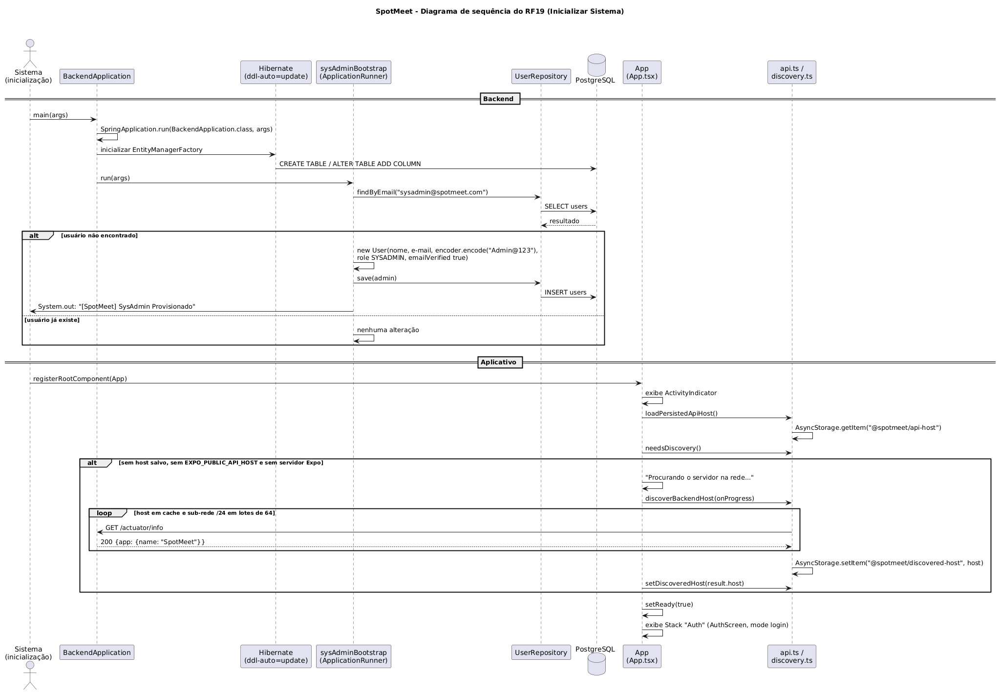

Fonte: próprio autor

#### RF20 – Consultar Status do Sistema

| Campo | Descrição |
|---|---|
| Função | Consulta o estado de funcionamento do sistema e dos seus subsistemas. |
| Descrição | Retorna ao Administrador do Sistema o estado geral do backend, a versão, o tempo em execução e a situação dos subsistemas de banco de dados, rede e memória da JVM, exibidos na tela de monitoramento do aplicativo. |
| Entradas | Nenhum corpo de requisição. Token JWT enviado no cabeçalho Authorization no formato Bearer, cujo e-mail identifica o executor. |
| Origem | Administrador do Sistema. |
| Saída | Objeto do tipo SystemStatusDTO contendo overallStatus (String, OPERATIONAL ou DEGRADED), version (String, fixa em 1.0.0-PROD), uptimeSeconds (long), timestamp (LocalDateTime), database e network (objetos do tipo SubsystemInfo com name, status e details) e memory (objeto do tipo MemoryInfo com totalMb, usedMb, freeMb e processors). |
| Destino | Tela AdminMonitoringReportsScreen (aba Monitoramento). |
| Ação | O Administrador do Sistema seleciona a aba Monitoramento, que exibe a tela AdminMonitoringReportsScreen. Ao receber o foco, a tela envia a requisição GET /api/admin/system/status, juntamente com a requisição de relatórios, e repete o envio de forma silenciosa a cada 4 segundos enquanto permanece em foco; o usuário também pode puxar a lista para atualizar. O Spring Security só permite a requisição para usuários com perfil ADMIN ou SYSADMIN, verificados pela anotação @PreAuthorize da classe AdminController. O método getSystemStatus da classe AdminController chama o método getSystemStatus da classe AdminService, que valida o executor pelo método findByEmail da UserRepository e verifica se o seu perfil é ADMIN ou SYSADMIN. Em seguida, o serviço define o estado geral como OPERATIONAL e calcula o tempo em execução. Para o subsistema de banco de dados, obtém uma conexão do DataSource e chama isValid com limite de 2 segundos, definindo o estado ONLINE ou WARNING; em caso de exceção, define FAILURE e altera o estado geral para DEGRADED. Para o subsistema de rede, obtém o endereço local por InetAddress.getLocalHost e informa o endereço, a porta e o nome do host com estado ONLINE, ou WARNING em caso de falha. Para a memória, lê os valores de Runtime.getRuntime. A tela exibe os cartões Banco, Rede e Recursos na seção "Status dos Subsistemas" e o estado geral no cabeçalho. |
| Pré-condição | O sistema deve estar em execução e o Administrador do Sistema deve estar autenticado com perfil ADMIN ou SYSADMIN. |
| Pós-condição | O sistema deve exibir o estado dos subsistemas ou, em caso de erro, retornar HTTP 403 para executor sem permissão ou HTTP 500 com a mensagem "Erro ao verificar status". |
| Efeitos colaterais | Nenhum. |

**Figura 26 – Diagrama de sequência do RF20**

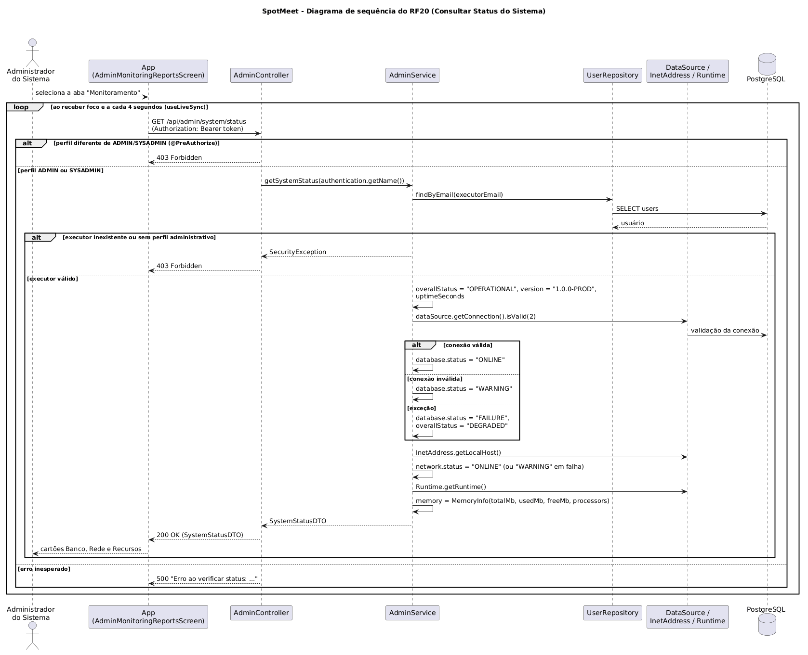

Fonte: próprio autor

#### RF21 – Consultar Relatórios

| Campo | Descrição |
|---|---|
| Função | Consulta relatórios agregados de usuários, organizações, comissões e auditoria. |
| Descrição | Gera um relatório com totais de usuários, organizações, comissões e registros de auditoria, além das 15 atividades de auditoria mais recentes, com e-mails mascarados e detalhes sanitizados conforme a LGPD pela classe LgpdMaskUtil. |
| Entradas | Nenhum corpo de requisição. Token JWT enviado no cabeçalho Authorization no formato Bearer, cujo e-mail identifica o executor. |
| Origem | Administrador do Sistema. |
| Saída | Objeto do tipo AdminReportDTO contendo totalUsers, verifiedUsers, usersByRole (mapa com as chaves USER, ADMIN e SYSADMIN), totalOrganizations, approvedOrganizations, pendingOrganizations, totalCommittees, totalAuditLogs, generatedAt (LocalDateTime) e recentActivities, lista de até 15 objetos do tipo AuditActivityDTO com id, action, executorName, executorEmailMasked, sanitizedDetails e createdAt. |
| Destino | Tela AdminMonitoringReportsScreen (aba Monitoramento). |
| Ação | O Administrador do Sistema seleciona a aba Monitoramento, que exibe a tela AdminMonitoringReportsScreen. Ao receber o foco, a tela envia a requisição GET /api/admin/reports e a repete de forma silenciosa a cada 4 segundos enquanto permanece em foco. O Spring Security só permite a requisição para usuários com perfil ADMIN ou SYSADMIN, verificados pela anotação @PreAuthorize da classe AdminController. O método getReports da classe AdminController chama o método getReports da classe AdminService, que valida o executor pelo método findByEmail da UserRepository. O serviço obtém todos os usuários por findAll da UserRepository e conta o total, os verificados e a quantidade por perfil; obtém todas as organizações por findAll da OrganizationRepository e conta o total, as aprovadas e as não aprovadas; obtém o total de comissões por count da CommitteeRepository e o total de registros de auditoria por count da AuditLogRepository. Em seguida, obtém os registros de auditoria mais recentes por findTop100ByOrderByCreatedAtDesc, limita o resultado a 15 itens e, para cada um, mascara o e-mail do autor pelo método maskEmail e remove senhas, segredos e tokens do texto pelo método sanitizeDetails da classe LgpdMaskUtil; registros sem autor recebem o nome "Sistema". Por fim, grava um registro de auditoria e retorna o relatório. A tela exibe as seções "Métricas do Ecossistema", "Distribuição de Perfis no Sistema" e "Auditoria Recente (Logs Anonimizados)". |
| Pré-condição | O sistema deve estar em execução e o Administrador do Sistema deve estar autenticado com perfil ADMIN ou SYSADMIN. |
| Pós-condição | O sistema deve exibir o relatório ou, em caso de erro, retornar HTTP 403 para executor sem permissão ou HTTP 500 com a mensagem "Erro ao gerar relatórios". |
| Efeitos colaterais | Registro em audit_logs com a ação ADMIN_REPORTS_VIEWED a cada consulta, inclusive nas atualizações automáticas a cada 4 segundos. |

**Figura 27 – Diagrama de sequência do RF21**

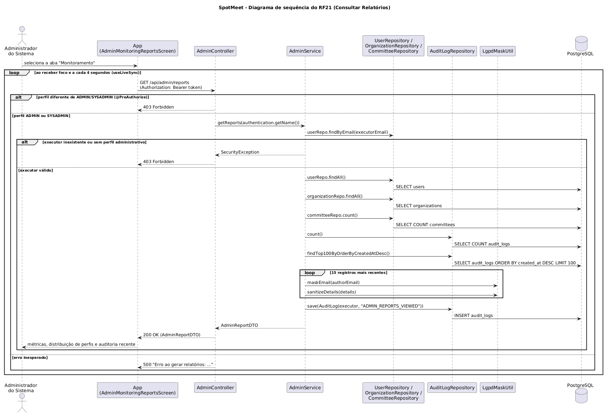

Fonte: próprio autor

#### RF22 – Reiniciar Subsistemas

| Campo | Descrição |
|---|---|
| Função | Solicita a reinicialização lógica dos subsistemas do servidor. |
| Descrição | Registra na auditoria a solicitação de reinicialização e sugere à JVM a execução da coleta de lixo por System.gc(). A reinicialização é global e lógica: não há seleção de subsistema, o processo do servidor não é reiniciado, nenhum cache ou pool de conexões é limpo e a disponibilidade para os usuários não é interrompida. |
| Entradas | Objeto opcional do tipo CriticalActionRequestDTO contendo confirmation (String) e reason (String opcional). O backend não valida o objeto nesta rota e utiliza apenas reason; o texto é gravado na coluna details de audit_logs, limitada a 1000 caracteres. |
| Origem | Administrador do Sistema. |
| Saída | Mapa com success (true), message ("Subsistemas reinicializados e sincronizados com sucesso. Estado operacional verificado."), executor (nome do administrador) e timestamp. |
| Destino | Tela AdminControlsScreen (aba Controles). |
| Ação | O Administrador do Sistema seleciona a aba Controles, que exibe a tela AdminControlsScreen, e clica no botão "Executar Reinicialização Segura" do cartão "Reiniciar Subsistemas & Cache". O sistema exibe o modal "Confirmar Reinicialização" com o campo "Motivo da reinicialização (opcional)". Ao clicar no botão "Reiniciar Agora", o aplicativo envia a requisição POST /api/admin/system/restart com confirmation igual a RESTART_SYSTEM e o motivo informado, ou "Reinicialização rotineira de subsistemas" quando o campo está vazio. O código RESTART_SYSTEM é definido apenas no aplicativo e não é verificado pelo backend. O Spring Security só permite a requisição para usuários com perfil ADMIN ou SYSADMIN, verificados pela anotação @PreAuthorize da classe AdminController. O método restartSystem da classe AdminController chama o método restartSystem da classe AdminService, que valida o executor pelo método findByEmail da UserRepository, adota o motivo recebido ou "Rotina administrativa periódica" quando o corpo ou o motivo são nulos, grava o registro de auditoria pelo método save da AuditLogRepository e chama System.gc(). Ao receber a resposta, o aplicativo fecha o modal e exibe a mensagem retornada. O botão "Cancelar" fecha o modal sem enviar a requisição. |
| Pré-condição | O sistema deve estar em execução e o Administrador do Sistema deve estar autenticado com perfil ADMIN ou SYSADMIN. |
| Pós-condição | O sistema deve avisar ao usuário se a reinicialização foi registrada com sucesso ou, em caso de erro, retornar HTTP 403 para executor sem permissão ou HTTP 500 com a mensagem "Erro ao reiniciar subsistemas". |
| Efeitos colaterais | Registro em audit_logs com a ação ADMIN_SYSTEM_RESTART e o motivo informado. |

**Figura 28 – Diagrama de sequência do RF22**

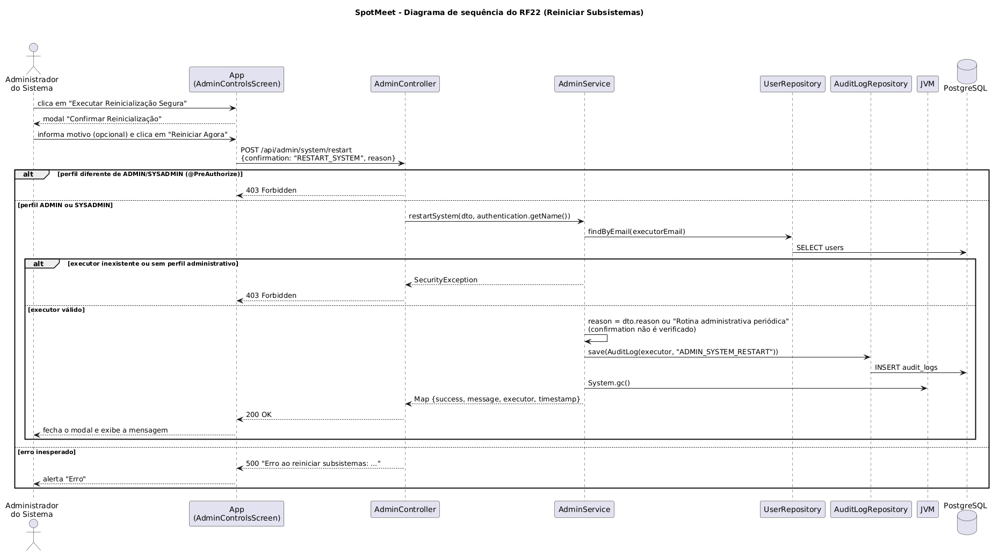

Fonte: próprio autor

#### RF23 – Resetar Sistema

| Campo | Descrição |
|---|---|
| Função | Remove todos os dados do sistema, preservando apenas a conta do administrador executor. |
| Descrição | Exclui, em uma única transação, os registros de auditoria de outros usuários, as solicitações de acesso, os membros de comissões, as comissões, os membros de organizações, as organizações e todos os usuários, exceto o administrador que executa a ação. |
| Entradas | Objeto do tipo CriticalActionRequestDTO contendo confirmation (String obrigatória, anotada com @NotBlank, que deve ser exatamente CONFIRM_FULL_RESET) e reason (String opcional, sem limite declarado no DTO; o texto é gravado na coluna details de audit_logs, limitada a 1000 caracteres). |
| Origem | Administrador do Sistema. |
| Saída | Mapa com success (true), message, adminPreserved (nome e e-mail do administrador preservado), reason e timestamp. |
| Destino | Tela AdminControlsScreen (aba Controles). |
| Ação | O Administrador do Sistema seleciona a aba Controles, que exibe a tela AdminControlsScreen, e clica no botão "Executar Reset Total do Sistema". O sistema exibe o modal "Reset Total do Sistema", que mostra o código CONFIRM_FULL_RESET e os campos "Digite CONFIRM_FULL_RESET" e "Motivo formal (Auditoria LGPD)". O botão "Executar Reset" permanece desabilitado até que o código digitado seja idêntico a CONFIRM_FULL_RESET. Ao clicar nele, o aplicativo envia a requisição POST /api/admin/system/reset com o código e o motivo informado, ou "Manutenção administrativa de segurança" quando o campo está vazio. O Spring Security só permite a requisição para usuários com perfil ADMIN ou SYSADMIN, verificados pela anotação @PreAuthorize da classe AdminController. A anotação @Valid rejeita com HTTP 400 um corpo com confirmation vazio. O método resetSystem da classe AdminController chama o método resetSystem da classe AdminService, que valida o executor pelo método findByEmail da UserRepository e verifica se confirmation é igual a CONFIRM_FULL_RESET; em caso negativo, lança IllegalArgumentException, convertida em HTTP 400 com a mensagem "Código de confirmação inválido". Em caso positivo, o serviço executa, nesta ordem, deleteAllExceptAdminLogs da AuditLogRepository, deleteAllInBatch da AccessRequestRepository, da CommitteeMemberRepository, da CommitteeRepository, da OrganizationMemberRepository e da OrganizationRepository, e deleteAllExceptAdmin da UserRepository, passando o identificador do executor. Por fim, grava o registro de auditoria do reset. Ao receber a resposta, o aplicativo fecha o modal, exibe a mensagem "Reset Total Concluído", encerra a sessão pelo método signOut e retorna à tela Auth. O botão "Cancelar" fecha o modal e limpa os campos. |
| Pré-condição | O sistema deve estar em execução e o Administrador do Sistema deve estar autenticado com perfil ADMIN ou SYSADMIN. |
| Pós-condição | O sistema deve avisar ao usuário se o reset ocorreu com sucesso ou, em caso de erro, retornar HTTP 400 para código de confirmação ausente ou inválido, HTTP 403 para executor sem permissão ou HTTP 500 com a mensagem "Erro ao executar reset", caso em que a transação é desfeita. |
| Efeitos colaterais | Exclusão dos dados das tabelas access_requests, committee_members, committees, organization_members e organizations, exclusão de todos os usuários da tabela users exceto o executor, inclusive outros administradores, exclusão dos registros de audit_logs de outros usuários e registro em audit_logs com a ação ADMIN_SYSTEM_FULL_RESET. A sessão do administrador é encerrada no aplicativo. |

**Figura 29 – Diagrama de sequência do RF23**

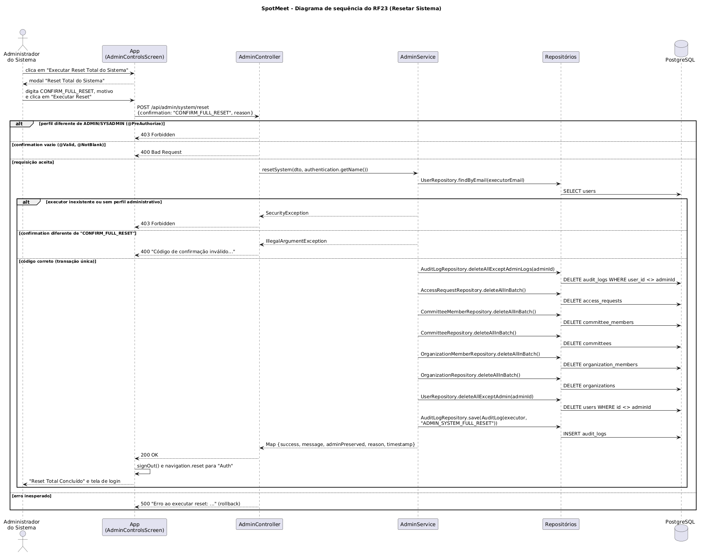

Fonte: próprio autor

## 7. Modelo do Sistema

Nesta seção descreve-se a forma de armazenamento dos dados pelo sistema. O banco de dados utilizado é o PostgreSQL 18, e as tabelas são criadas e atualizadas pelo Hibernate a partir das entidades. A Figura 30 exibe o modelo relacional implantado.

**Figura 30 – Modelo relacional do sistema**

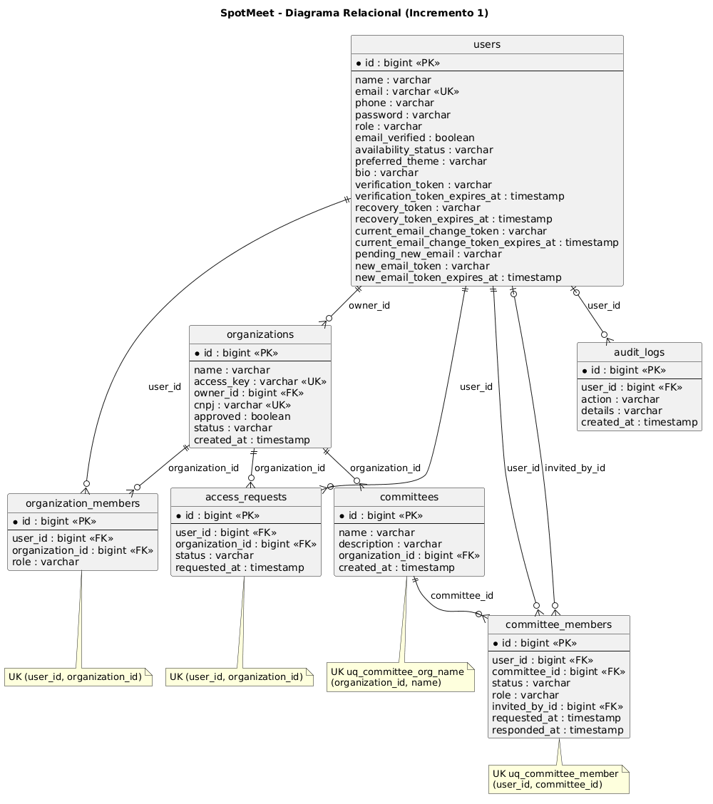

Fonte: próprio autor

O dicionário de dados descreve cada campo de cada tabela utilizada no sistema.

#### 1. users

Armazena as contas de usuário do sistema, incluindo o administrador do sistema criado na inicialização, e os códigos temporários de verificação, recuperação de senha e troca de e-mail.

| Campo | id |
|---|---|
| Tipo de Dado | Inteiro longo (bigint) |
| Pode ser Nulo | Não |
| Chave Primária | Sim (exclusivo) |
| Chave Estrangeira | Não |
| Outros | Campo identidade (início em 1, incremento em 1) |
| Descrição | Identificador único, gerado automaticamente |

| Campo | availability_status |
|---|---|
| Tipo de Dado | String (varchar de 255 caracteres) |
| Pode ser Nulo | Não |
| Chave Primária | Não |
| Chave Estrangeira | Não |
| Outros | Valores permitidos: PRESENT, ONLINE, BUSY, AWAY |
| Descrição | `PRESENT`, `ONLINE`, `BUSY` ou `AWAY`. Padrão `PRESENT` |

| Campo | bio |
|---|---|
| Tipo de Dado | String (varchar de 500 caracteres) |
| Pode ser Nulo | Sim |
| Chave Primária | Não |
| Chave Estrangeira | Não |
| Outros | - |
| Descrição | Biografia curta do usuário |

| Campo | current_email_change_token |
|---|---|
| Tipo de Dado | String (varchar de 255 caracteres) |
| Pode ser Nulo | Sim |
| Chave Primária | Não |
| Chave Estrangeira | Não |
| Outros | - |
| Descrição | Código OTP da etapa 1 da troca de e-mail (enviado ao e-mail atual) |

| Campo | current_email_change_token_expires_at |
|---|---|
| Tipo de Dado | Data e hora (timestamp) |
| Pode ser Nulo | Sim |
| Chave Primária | Não |
| Chave Estrangeira | Não |
| Outros | - |
| Descrição | Validade do código acima |

| Campo | email |
|---|---|
| Tipo de Dado | String (varchar de 255 caracteres) |
| Pode ser Nulo | Não |
| Chave Primária | Não |
| Chave Estrangeira | Não |
| Outros | Único |
| Descrição | E-mail, usado como identificador de login |

| Campo | email_verified |
|---|---|
| Tipo de Dado | Lógico (boolean) |
| Pode ser Nulo | Não |
| Chave Primária | Não |
| Chave Estrangeira | Não |
| Outros | - |
| Descrição | Indica se o e-mail foi confirmado por OTP. Padrão `false` |

| Campo | name |
|---|---|
| Tipo de Dado | String (varchar de 255 caracteres) |
| Pode ser Nulo | Não |
| Chave Primária | Não |
| Chave Estrangeira | Não |
| Outros | - |
| Descrição | Nome completo do usuário |

| Campo | new_email_token |
|---|---|
| Tipo de Dado | String (varchar de 255 caracteres) |
| Pode ser Nulo | Sim |
| Chave Primária | Não |
| Chave Estrangeira | Não |
| Outros | - |
| Descrição | Código OTP da etapa 2 da troca de e-mail (enviado ao novo e-mail) |

| Campo | new_email_token_expires_at |
|---|---|
| Tipo de Dado | Data e hora (timestamp) |
| Pode ser Nulo | Sim |
| Chave Primária | Não |
| Chave Estrangeira | Não |
| Outros | - |
| Descrição | Validade do código acima |

| Campo | password |
|---|---|
| Tipo de Dado | String (varchar de 255 caracteres) |
| Pode ser Nulo | Não |
| Chave Primária | Não |
| Chave Estrangeira | Não |
| Outros | - |
| Descrição | Hash BCrypt da senha; nunca é devolvido pela API |

| Campo | pending_new_email |
|---|---|
| Tipo de Dado | String (varchar de 255 caracteres) |
| Pode ser Nulo | Sim |
| Chave Primária | Não |
| Chave Estrangeira | Não |
| Outros | - |
| Descrição | Novo e-mail aguardando confirmação na troca em duas etapas |

| Campo | phone |
|---|---|
| Tipo de Dado | String (varchar de 255 caracteres) |
| Pode ser Nulo | Sim |
| Chave Primária | Não |
| Chave Estrangeira | Não |
| Outros | - |
| Descrição | Telefone de contato |

| Campo | preferred_theme |
|---|---|
| Tipo de Dado | String (varchar de 255 caracteres) |
| Pode ser Nulo | Não |
| Chave Primária | Não |
| Chave Estrangeira | Não |
| Outros | Valores permitidos: LIGHT, DARK, SYSTEM |
| Descrição | `LIGHT`, `DARK` ou `SYSTEM`. Padrão `DARK` |

| Campo | recovery_token |
|---|---|
| Tipo de Dado | String (varchar de 255 caracteres) |
| Pode ser Nulo | Sim |
| Chave Primária | Não |
| Chave Estrangeira | Não |
| Outros | - |
| Descrição | Código OTP de recuperação de senha |

| Campo | recovery_token_expires_at |
|---|---|
| Tipo de Dado | Data e hora (timestamp) |
| Pode ser Nulo | Sim |
| Chave Primária | Não |
| Chave Estrangeira | Não |
| Outros | - |
| Descrição | Validade do código acima (5 minutos) |

| Campo | role |
|---|---|
| Tipo de Dado | String (varchar de 255 caracteres) |
| Pode ser Nulo | Não |
| Chave Primária | Não |
| Chave Estrangeira | Não |
| Outros | - |
| Descrição | `USER`, `ADMIN` ou `SYSADMIN`. Padrão `USER` |

| Campo | verification_token |
|---|---|
| Tipo de Dado | String (varchar de 255 caracteres) |
| Pode ser Nulo | Sim |
| Chave Primária | Não |
| Chave Estrangeira | Não |
| Outros | - |
| Descrição | Código OTP de verificação de cadastro |

| Campo | verification_token_expires_at |
|---|---|
| Tipo de Dado | Data e hora (timestamp) |
| Pode ser Nulo | Sim |
| Chave Primária | Não |
| Chave Estrangeira | Não |
| Outros | - |
| Descrição | Validade do código acima (5 minutos) |

#### 2. organizations

Armazena as organizações cadastradas pelos usuários. Cada organização possui um dono e só é liberada após a aprovação do administrador do sistema.

| Campo | id |
|---|---|
| Tipo de Dado | Inteiro longo (bigint) |
| Pode ser Nulo | Não |
| Chave Primária | Sim (exclusivo) |
| Chave Estrangeira | Não |
| Outros | Campo identidade (início em 1, incremento em 1) |
| Descrição | Identificador único |

| Campo | access_key |
|---|---|
| Tipo de Dado | String (varchar de 100 caracteres) |
| Pode ser Nulo | Não |
| Chave Primária | Não |
| Chave Estrangeira | Não |
| Outros | Único |
| Descrição | Chave de acesso, formato `#Nome`, usada para solicitar entrada |

| Campo | approved |
|---|---|
| Tipo de Dado | Lógico (boolean) |
| Pode ser Nulo | Não |
| Chave Primária | Não |
| Chave Estrangeira | Não |
| Outros | - |
| Descrição | Aprovada pelo SysAdmin. Padrão `false` |

| Campo | cnpj |
|---|---|
| Tipo de Dado | String (varchar de 255 caracteres) |
| Pode ser Nulo | Sim |
| Chave Primária | Não |
| Chave Estrangeira | Não |
| Outros | Único |
| Descrição | CNPJ, opcional; se informado, não pode repetir |

| Campo | created_at |
|---|---|
| Tipo de Dado | Data e hora (timestamp) |
| Pode ser Nulo | Não |
| Chave Primária | Não |
| Chave Estrangeira | Não |
| Outros | - |
| Descrição | Data de criação |

| Campo | name |
|---|---|
| Tipo de Dado | String (varchar de 255 caracteres) |
| Pode ser Nulo | Não |
| Chave Primária | Não |
| Chave Estrangeira | Não |
| Outros | - |
| Descrição | Nome da organização |

| Campo | status |
|---|---|
| Tipo de Dado | String (varchar de 255 caracteres) |
| Pode ser Nulo | Sim |
| Chave Primária | Não |
| Chave Estrangeira | Não |
| Outros | - |
| Descrição | `PENDING`, `APPROVED`, `REJECTED` ou `BLOCKED`. Padrão `PENDING`, definido no Java (a coluna não tem `NOT NULL`) |

| Campo | owner_id |
|---|---|
| Tipo de Dado | Inteiro longo (bigint) |
| Pode ser Nulo | Não |
| Chave Primária | Não |
| Chave Estrangeira | Sim (users : id) |
| Outros | - |
| Descrição | Usuário que criou a organização |

#### 3. organization_members

Armazena o vínculo entre usuários e organizações e o papel de cada usuário dentro da organização. Um usuário pode participar de várias organizações, e uma organização pode ter vários usuários.

| Campo | id |
|---|---|
| Tipo de Dado | Inteiro longo (bigint) |
| Pode ser Nulo | Não |
| Chave Primária | Sim (exclusivo) |
| Chave Estrangeira | Não |
| Outros | Campo identidade (início em 1, incremento em 1) |
| Descrição | Identificador único |

| Campo | role |
|---|---|
| Tipo de Dado | String (varchar de 255 caracteres) |
| Pode ser Nulo | Não |
| Chave Primária | Não |
| Chave Estrangeira | Não |
| Outros | Valores permitidos: ORG_OWNER, ORG_VICE_OWNER, ORG_SUBOWNER, MEMBER |
| Descrição | `ORG_OWNER`, `ORG_VICE_OWNER`, `ORG_SUBOWNER` ou `MEMBER`. Padrão `MEMBER` |

| Campo | organization_id |
|---|---|
| Tipo de Dado | Inteiro longo (bigint) |
| Pode ser Nulo | Não |
| Chave Primária | Não |
| Chave Estrangeira | Sim (organizations : id) |
| Outros | Único em conjunto com user_id |
| Descrição | Organização |

| Campo | user_id |
|---|---|
| Tipo de Dado | Inteiro longo (bigint) |
| Pode ser Nulo | Não |
| Chave Primária | Não |
| Chave Estrangeira | Sim (users : id) |
| Outros | Único em conjunto com organization_id |
| Descrição | Membro |

#### 4. access_requests

Armazena as solicitações de acesso feitas por usuários a organizações, informando a chave de acesso.

| Campo | id |
|---|---|
| Tipo de Dado | Inteiro longo (bigint) |
| Pode ser Nulo | Não |
| Chave Primária | Sim (exclusivo) |
| Chave Estrangeira | Não |
| Outros | Campo identidade (início em 1, incremento em 1) |
| Descrição | Identificador único |

| Campo | requested_at |
|---|---|
| Tipo de Dado | Data e hora (timestamp) |
| Pode ser Nulo | Não |
| Chave Primária | Não |
| Chave Estrangeira | Não |
| Outros | - |
| Descrição | Data da solicitação |

| Campo | status |
|---|---|
| Tipo de Dado | String (varchar de 20 caracteres) |
| Pode ser Nulo | Não |
| Chave Primária | Não |
| Chave Estrangeira | Não |
| Outros | Valores permitidos: PENDING, APPROVED, REJECTED |
| Descrição | `PENDING`, `APPROVED` ou `REJECTED`. Padrão `PENDING` |

| Campo | organization_id |
|---|---|
| Tipo de Dado | Inteiro longo (bigint) |
| Pode ser Nulo | Não |
| Chave Primária | Não |
| Chave Estrangeira | Sim (organizations : id) |
| Outros | Único em conjunto com user_id |
| Descrição | Organização alvo |

| Campo | user_id |
|---|---|
| Tipo de Dado | Inteiro longo (bigint) |
| Pode ser Nulo | Não |
| Chave Primária | Não |
| Chave Estrangeira | Sim (users : id) |
| Outros | Único em conjunto com organization_id |
| Descrição | Quem solicitou o acesso |

#### 5. committees

Armazena as comissões criadas dentro de cada organização.

| Campo | id |
|---|---|
| Tipo de Dado | Inteiro longo (bigint) |
| Pode ser Nulo | Não |
| Chave Primária | Sim (exclusivo) |
| Chave Estrangeira | Não |
| Outros | Campo identidade (início em 1, incremento em 1) |
| Descrição | Identificador único |

| Campo | created_at |
|---|---|
| Tipo de Dado | Data e hora (timestamp) |
| Pode ser Nulo | Sim |
| Chave Primária | Não |
| Chave Estrangeira | Não |
| Outros | - |
| Descrição | Data de criação, preenchida pelo Java ao salvar |

| Campo | description |
|---|---|
| Tipo de Dado | String (varchar de 500 caracteres) |
| Pode ser Nulo | Sim |
| Chave Primária | Não |
| Chave Estrangeira | Não |
| Outros | - |
| Descrição | Descrição opcional |

| Campo | name |
|---|---|
| Tipo de Dado | String (varchar de 100 caracteres) |
| Pode ser Nulo | Não |
| Chave Primária | Não |
| Chave Estrangeira | Não |
| Outros | Único em conjunto com organization_id (restrição uq_committee_org_name) |
| Descrição | Nome da comissão, único dentro da organização |

| Campo | organization_id |
|---|---|
| Tipo de Dado | Inteiro longo (bigint) |
| Pode ser Nulo | Não |
| Chave Primária | Não |
| Chave Estrangeira | Sim (organizations : id) |
| Outros | Único em conjunto com name (restrição uq_committee_org_name) |
| Descrição | Organização à qual pertence |

#### 6. committee_members

Armazena o vínculo entre usuários e comissões. O vínculo nasce de um convite feito por um administrador da organização ou de uma solicitação do próprio usuário.

| Campo | id |
|---|---|
| Tipo de Dado | Inteiro longo (bigint) |
| Pode ser Nulo | Não |
| Chave Primária | Sim (exclusivo) |
| Chave Estrangeira | Não |
| Outros | Campo identidade (início em 1, incremento em 1) |
| Descrição | Identificador único |

| Campo | requested_at |
|---|---|
| Tipo de Dado | Data e hora (timestamp) |
| Pode ser Nulo | Sim |
| Chave Primária | Não |
| Chave Estrangeira | Não |
| Outros | - |
| Descrição | Data do convite ou da solicitação |

| Campo | responded_at |
|---|---|
| Tipo de Dado | Data e hora (timestamp) |
| Pode ser Nulo | Sim |
| Chave Primária | Não |
| Chave Estrangeira | Não |
| Outros | - |
| Descrição | Data em que o convite/solicitação foi respondido |

| Campo | role |
|---|---|
| Tipo de Dado | String (varchar de 20 caracteres) |
| Pode ser Nulo | Não |
| Chave Primária | Não |
| Chave Estrangeira | Não |
| Outros | Valores permitidos: COMMITTEE_ADMIN, MEMBER |
| Descrição | `COMMITTEE_ADMIN` ou `MEMBER`. Padrão `MEMBER` |

| Campo | status |
|---|---|
| Tipo de Dado | String (varchar de 30 caracteres) |
| Pode ser Nulo | Não |
| Chave Primária | Não |
| Chave Estrangeira | Não |
| Outros | Valores permitidos: PENDING_USER_ACCEPTANCE, PENDING_LEADER_APPROVAL, ACTIVE, DECLINED |
| Descrição | `PENDING_USER_ACCEPTANCE` (convite pendente), `PENDING_LEADER_APPROVAL` (solicitação pendente), `ACTIVE` ou `DECLINED`. Padrão `PENDING_USER_ACCEPTANCE` |

| Campo | committee_id |
|---|---|
| Tipo de Dado | Inteiro longo (bigint) |
| Pode ser Nulo | Não |
| Chave Primária | Não |
| Chave Estrangeira | Sim (committees : id) |
| Outros | Único em conjunto com user_id (restrição uq_committee_member) |
| Descrição | Comissão |

| Campo | invited_by_id |
|---|---|
| Tipo de Dado | Inteiro longo (bigint) |
| Pode ser Nulo | Sim |
| Chave Primária | Não |
| Chave Estrangeira | Sim (users : id) |
| Outros | - |
| Descrição | Quem convidou; nulo quando o vínculo nasceu de uma solicitação do próprio membro |

| Campo | user_id |
|---|---|
| Tipo de Dado | Inteiro longo (bigint) |
| Pode ser Nulo | Não |
| Chave Primária | Não |
| Chave Estrangeira | Sim (users : id) |
| Outros | Único em conjunto com committee_id (restrição uq_committee_member) |
| Descrição | Integrante |

#### 7. audit_logs

Armazena o registro das ações relevantes executadas no sistema, para fins de auditoria.

| Campo | id |
|---|---|
| Tipo de Dado | Inteiro longo (bigint) |
| Pode ser Nulo | Não |
| Chave Primária | Sim (exclusivo) |
| Chave Estrangeira | Não |
| Outros | Campo identidade (início em 1, incremento em 1) |
| Descrição | Identificador único |

| Campo | action |
|---|---|
| Tipo de Dado | String (varchar de 255 caracteres) |
| Pode ser Nulo | Não |
| Chave Primária | Não |
| Chave Estrangeira | Não |
| Outros | - |
| Descrição | Código da ação (ex.: `USER_REGISTERED`, `ORGANIZATION_CREATED`, `ADMIN_SYSTEM_FULL_RESET`) |

| Campo | created_at |
|---|---|
| Tipo de Dado | Data e hora (timestamp) |
| Pode ser Nulo | Não |
| Chave Primária | Não |
| Chave Estrangeira | Não |
| Outros | - |
| Descrição | Data e hora da ação |

| Campo | details |
|---|---|
| Tipo de Dado | String (varchar de 1000 caracteres) |
| Pode ser Nulo | Sim |
| Chave Primária | Não |
| Chave Estrangeira | Não |
| Outros | - |
| Descrição | Texto livre com o detalhe da ação, sem dados sensíveis |

| Campo | user_id |
|---|---|
| Tipo de Dado | Inteiro longo (bigint) |
| Pode ser Nulo | Sim |
| Chave Primária | Não |
| Chave Estrangeira | Sim (users : id) |
| Outros | - |
| Descrição | Quem executou a ação |

## 8. Planejamento de Testes

### 8.1. Ferramentas e método

| Tipo de teste | Ferramenta | Como é aplicado |
|---|---|---|
| Teste de unidade (servidor) | JUnit 5 com Mockito, incluídos no Spring Boot Test 3.3.5 | Cada método das classes de serviço é testado isoladamente, com os repositórios simulados, verificando o retorno e as exceções de cada regra de negócio. |
| Teste de integração (servidor) | Spring Boot Test com MockMvc | Cada rota da API é chamada com e sem token, com dados válidos e inválidos, verificando o código HTTP e o corpo da resposta. |
| Teste de unidade (aplicativo) | Jest com React Native Testing Library | Funções de validação (`validators.ts`) e componentes de tela são testados sem servidor. |
| Verificação estática | `./mvnw compile` e `npx tsc --noEmit` | Executados antes de cada commit; o commit só é feito se os dois terminarem sem erro. |
| Teste de release (manual) | Aparelho Android e iPhone reais, com Expo Go e APK | Roteiro da seção 8.2 executado ao final do incremento, registrando para cada caso a data, o aparelho, o resultado esperado e o resultado obtido. |

Os testes automatizados são executados com `./mvnw test` no servidor e `npx jest` no aplicativo. No Incremento 1, o servidor possui a classe de teste `BackendApplicationTests`, que depende de um banco PostgreSQL e de uma conta de e-mail configurados; os demais testes automatizados estão planejados para o Incremento 2.

### 8.2. Casos de teste de release

| Caso | Requisito | Procedimento | Resultado esperado |
|---|---|---|---|
| CT01 | RF01 | Cadastrar com a senha `abc123` | Cadastro recusado, com a regra de senha não atendida |
| CT02 | RF01 | Cadastrar com um e-mail já verificado | Mensagem de conta já cadastrada (409) |
| CT03 | RF01 | Informar um código de verificação incorreto | Mensagem de código inválido; conta continua não verificada |
| CT04 | RF02 | Fazer login com e-mail ainda não verificado | Aplicativo leva à tela de verificação (403 EMAIL_NOT_VERIFIED) |
| CT05 | RF02 | Fazer login com senha incorreta | Mensagem "E-mail ou senha incorretos" (401) |
| CT06 | RF03 | Solicitar acesso com uma chave inexistente | Mensagem de organização não encontrada |
| CT07 | RF03 | Solicitar acesso duas vezes à mesma organização | Segunda solicitação recusada (409) |
| CT08 | RF04 | Membro comum tentar aprovar uma solicitação | Acesso negado (403) |
| CT09 | RF05 | Subdono tentar remover um vice-líder | Acesso negado |
| CT10 | RF06 | Criar organização com chave sem o caractere `#` | Cadastro recusado (400) |
| CT11 | RF06 | Criar organização com chave já utilizada | Cadastro recusado (409) |
| CT12 | RF07 | Enviar `approved: true` no corpo da edição | Campo ignorado; organização continua pendente |
| CT13 | RF08 | Aprovar uma organização pendente | Organização aparece como aprovada para o dono em até 4 segundos |
| CT14 | RF09 | Criar comissão com nome contendo espaço | Cadastro recusado (400) |
| CT15 | RF09 | Criar duas comissões com o mesmo nome na mesma organização | Segunda criação recusada (409) |
| CT16 | RF11 | Convidar um usuário que não pertence à organização | Convite recusado |
| CT17 | RF12 | Membro solicitar entrada e líder rejeitar | Vínculo com situação DECLINED |
| CT18 | RF14 | Trocar a senha informando a senha atual errada | Troca recusada (400) |
| CT19 | RF14 | Trocar a senha por uma igual à atual | Troca recusada (400) |
| CT20 | RF15 | Usar o código de recuperação após 5 minutos | Código recusado por expiração |
| CT21 | RF17 | Salvar o tema claro, sair e entrar novamente | Tema claro mantido |
| CT22 | RF18 | Trocar o e-mail informando o código errado na segunda etapa | Troca recusada; e-mail original mantido |
| CT23 | RF20 | Consultar o status do sistema | Exibidos os subsistemas Banco, Rede e Recursos, com a versão e o tempo de atividade |
| CT24 | RF21 | Consultar os relatórios | Nenhum e-mail exibido por completo |
| CT25 | RF23 | Executar o reset com o código digitado errado | Botão de confirmação permanece desabilitado |
| CT26 | Todos | Chamar qualquer rota protegida sem token | Acesso negado (403) |
| CT27 | RNF14 | Parar e iniciar o servidor com dados cadastrados | Dados preservados |

## 9. Evolução do Sistema

O Incremento 1 foi modelado para receber a gestão de reuniões nos próximos incrementos. As comissões já possuem integrantes e papéis, o que permite associar reuniões, pautas e atas a uma comissão sem alterar as tabelas existentes. O esquema do banco é atualizado pelo Hibernate sem apagar os dados (RNF14), de forma que os dados cadastrados no Incremento 1 continuam válidos nos incrementos seguintes.
